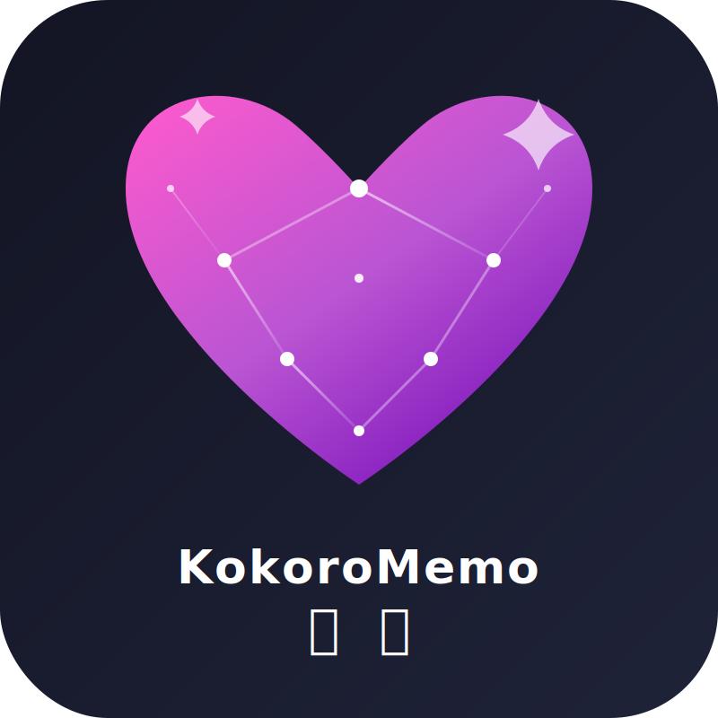

<p align="center">
  
</p>

<h1 align="center">KokoroMemo / 心忆</h1>

<p align="center">
  <em>让 AI 角色不只回应你，也记得你。</em>
</p>

<p align="center">
  <a href="https://github.com/CyrilPeng/KokoroMemo">GitHub</a> ·
  <a href="#下载发行版">下载发行版</a> ·
  <a href="#快速开始">快速开始</a> ·
  <a href="#接入-airp--ai-客户端">接入客户端</a> ·
  <a href="#记忆审核流程">记忆审核</a> ·
  <a href="#支持的-provider">支持的 Provider</a>
</p>

---

## KokoroMemo 是什么？

**KokoroMemo（心忆）** 是一个面向 **AI 角色扮演（AIRP）**、AI 游戏、AI 桌宠、SillyTavern 类前端与其他 OpenAI-compatible 客户端的 **本地长期记忆核心**。

**用可审阅的记忆卡片、图结构关系、层级摘要和本地语义索引，让 AI 不只是在当下回应你，也能在未来记得你。**

它作为一个运行在本机的 OpenAI-compatible 代理，位于你的 AI 客户端与真实大模型之间。客户端仍然像往常一样请求聊天模型，KokoroMemo 会在中间完成：

```text
接收聊天请求
→ 保存完整对话
→ 检索本地长期记忆
→ 将相关记忆注入上下文
→ 转发给真实聊天模型
→ 流式返回回复
→ 提炼候选记忆
→ 等待审核或自动入库
```

KokoroMemo 的目标不是简单地把聊天记录塞进向量库，而是为 AI 角色提供一套更适合长期陪伴和角色扮演的记忆系统：

```text
SQLite 记忆卡片库
+ LanceDB 语义索引
+ 图结构关系索引
+ 标签与层级摘要
+ Hot State 会话状态板
+ Retrieval Gate 按需召回门控
+ 半自动记忆审核
```

它可以帮助 AI 角色跨会话记住你的称呼、偏好、边界、关系进展、重要约定、剧情状态与共同经历，同时尽量避免 AI 自动记忆带来的幻觉污染和记忆混乱。

---

## 热记忆 / 温记忆 / 冷记忆

KokoroMemo 采用分层记忆策略，避免每一轮都昂贵地搜索长期向量库：

```text
热记忆 Hot State：当前会话状态板，记录正在发生的场景、地点、任务、承诺、边界和关系状态，默认每轮注入。
温记忆 Card Graph：经审核的长期记忆卡片、关系边和层级摘要，负责稳定跨会话事实。
冷记忆 Semantic Index：LanceDB 语义索引，仅在需要具体历史细节时由 Retrieval Gate 按需调用。
```

请求流程会先注入 `【KokoroMemo 会话状态板】`，再由 Retrieval Gate 判断是否需要执行长期召回。普通短句和当前剧情推进可以只依赖状态板；当用户提到“还记得 / 上次 / 之前 / 约定”等历史触发词，或状态板置信度不足时，再调用 LanceDB、图扩展和可选 Rerank。

---

## 为什么需要 KokoroMemo？

很多 AIRP 客户端、AI 游戏和桌宠支持自定义 OpenAI Base URL，但它们通常不提供稳定的长期记忆系统。

这会导致一个常见体验：

> 她能在当前上下文里回应你，却很难在下一次相遇时真正记住你们之间发生过什么。

KokoroMemo 解决的是这一层问题。

它不要求原客户端内置向量库，也不要求原客户端支持知识库。只要客户端可以填写 OpenAI-compatible API 地址，就可以让请求先经过 KokoroMemo，再由 KokoroMemo 转发到真实聊天模型。

```text
AI 游戏 / AIRP 客户端 / 桌宠 / SillyTavern
        ↓
KokoroMemo 本地代理
        ↓
真实聊天模型 API
```

---

## 核心特性

### 本地长期记忆核心

KokoroMemo 默认将完整对话与记忆数据保存在本地：

```text
完整对话：用于回溯、导出、溯源、重新提炼
记忆卡片：用于长期记忆管理
关系边：用于表达记忆之间的约束、冲突、继承和关联
层级摘要：用于压缩长期剧情、关系和角色状态
语义索引：用于快速召回相关记忆
```

### 记忆卡片，而不是聊天记录堆积

KokoroMemo 不建议把每轮聊天原样作为长期记忆。

长期记忆会被整理成可读、可审阅、可编辑的 **记忆卡片**：

```text
标题：玩家偏好：轻度撒娇与吃醋
类型：preference
作用域：character
内容：玩家喜欢 Yuki 偶尔撒娇和轻度吃醋，但不喜欢过度威胁或病态表达。
标签：用户偏好、语气、亲密互动、边界
来源：第 12-14 轮对话
状态：approved
```

这样做的好处是：

- 用户能看懂 AI 记住了什么
- 用户能拒绝不准确的候选记忆
- 用户能编辑不够准确的记忆
- 旧记忆可以被废弃或替代
- 记忆之间可以建立结构关系
- 向量索引损坏后可以从 SQLite 重建

### 半自动记忆审核

KokoroMemo 不会默认让 AI 无限自动整理长期记忆。

对话结束后，系统会生成候选记忆，并根据审核策略处理：

```text
低风险、高置信候选 → 可自动通过
关系重大变化 → 进入记忆收件箱
用户边界变化 → 进入记忆收件箱
助手单方面编造 → 不自动生效
低价值寒暄 → 直接忽略
```

用户可以在管理界面或审核接口中处理候选记忆：

```text
保存
编辑后保存
拒绝
合并到已有卡片
忽略类似内容
废弃旧卡并保存新卡
```

### SQLite + LanceDB

KokoroMemo 采用本地双层存储：

```text
SQLite  = 记忆本体 / 完整对话 / 卡片 / 标签 / 关系边 / 摘要 / 审核记录 / 任务队列
LanceDB = approved 记忆卡片与摘要的语义索引
```

LanceDB 不是唯一数据源。它只是一个可重建的检索索引。  
真正长期可信的数据保存在 SQLite 中。

### 图结构关系索引

记忆之间不只是“相似”关系，还可能存在：

```text
supports      A 支持 B
constrains    A 约束 B
contradicts   A 与 B 冲突
supersedes    A 替代 B
elaborates    A 详细说明 B
belongs_to    A 属于 B
continues     A 延续 B
same_as       A 与 B 等价或重复
```

例如：

```text
卡片 A：玩家喜欢轻度吃醋互动
卡片 B：玩家不喜欢威胁、自伤或病态表达
关系边：B constrains A
```

当系统召回卡片 A 时，会同时带出卡片 B 作为约束，避免角色把“轻度吃醋”演变成用户不喜欢的病态表达。

### 层级摘要

长期 RP 会话通常会持续很久。只靠底层聊天记录和零散卡片并不稳定。

KokoroMemo 使用层级压缩：

```text
L0 原始消息
L1 小段对话摘要
L2 记忆卡片
L3 会话阶段摘要
L4 用户画像 / 角色关系画像 / 世界状态摘要
```

这样在几百轮、几千轮对话后，系统仍然可以先理解高层状态，再补充具体细节。

### 多路召回

KokoroMemo 不只依赖向量检索。

一次记忆召回可以同时结合：

```text
向量召回：找到语义相关卡片
标签召回：找到同类偏好、边界、剧情标签
全文检索：找到名字、地点、约定、物品等精确关键词
图扩展：带出约束、替代、冲突和相邻事件
层级摘要：提供长期关系和剧情背景
近期重要卡片：补足最近发生的重要事件
固定边界卡片：始终保护用户偏好和禁忌
```

### OpenAI-compatible 代理

目标支持常见 OpenAI Chat Completions 接口：

```text
GET  /v1/models
POST /v1/chat/completions
POST /chat/completions
```

只要客户端支持自定义 OpenAI Base URL，就可以尝试接入 KokoroMemo。

### 流式响应兼容

KokoroMemo 支持 `stream: true`。

当真实聊天模型以流式方式返回内容时，KokoroMemo 会一边把 SSE 内容转发给客户端，一边在后台收集完整回复，用于后续对话落盘和记忆提炼。

### Provider 可替换

KokoroMemo 支持把聊天模型、Embedding 模型和 Rerank 模型分开配置。

默认设计：

```text
Embedding：默认开启，是长期记忆召回的核心
Rerank：默认关闭，是提高召回精度的增强项
Chat LLM：由用户自行配置
```

### 桌面发行版

KokoroMemo 提供 Tauri 桌面端发行版。桌面版启动时会自动拉起本地后端服务，默认监听 `127.0.0.1:14514`，无需用户单独打开命令行启动 Python 后端。

Windows 发行版遵循单 exe 分发原则：`Portable.zip` 解压后的文件夹内只有 `KokoroMemo.exe`，MSI 安装版同样安装内嵌后端的主程序，不会额外分离携带 `kokoromemo-server.exe`。关闭窗口时默认最小化到系统托盘，可在设置页关闭该行为；设置页也提供 GitHub 最新发行版检测。

---

## 适合谁使用？

KokoroMemo 适合：

- 想让 AI 角色长期记得自己的 AIRP 用户
- 想给 AI 游戏外挂长期记忆的玩家
- 想给 AI 桌宠加入本地记忆的开发者
- 想管理多角色、多会话记忆的 SillyTavern 用户
- 想构建私有角色记忆库的创作者
- 想研究本地 RAG、长期记忆、记忆卡片和图结构召回的开发者

KokoroMemo 不适合：

- 只需要一次性聊天的用户
- 不希望配置任何 API 的用户
- 不想处理记忆审核的用户
- 希望所有记忆完全自动且永不出错的用户

---

## 工作原理

### 总体架构

```text
┌───────────────────────────────────┐
│ AIRP / AI Game / Desktop Pet      │
│ OpenAI-compatible Client          │
└─────────────────┬─────────────────┘
                  │
                  │ POST /v1/chat/completions
                  ▼
┌───────────────────────────────────┐
│ KokoroMemo Local Proxy            │
├───────────────────────────────────┤
│ Request Parser                    │
│ Conversation Resolver             │
│ Retrieval Query Builder           │
│ Multi-route Memory Retriever      │
│ Graph Expander                    │
│ Memory Injector                   │
│ LLM Forwarder                     │
│ Stream Recorder                   │
│ Memory Extractor                  │
│ Review Policy                     │
└──────────────┬────────────┬───────┘
               │            │
               ▼            ▼
┌─────────────────────┐  ┌─────────────────────┐
│ SQLite              │  │ LanceDB              │
│ Cards / Graph / Log │  │ Semantic Index       │
└─────────────────────┘  └─────────────────────┘
               │
               ▼
┌───────────────────────────────────┐
│ Real LLM / Embedding / Rerank API │
└───────────────────────────────────┘
```

### 一次聊天请求会发生什么？

1. 客户端向 KokoroMemo 发送聊天请求。
2. KokoroMemo 解析 `messages`、`model`、`stream` 等参数。
3. KokoroMemo 根据 Header、metadata 或 system prompt 识别用户、角色和会话。
4. KokoroMemo 保存原始请求和消息到 SQLite。
5. KokoroMemo 根据最新发言、最近上下文和角色信息构造检索 query。
6. KokoroMemo 从记忆卡片、摘要、标签、图关系和 LanceDB 语义索引中召回相关内容。
7. KokoroMemo 对候选记忆进行去重、评分和预算控制。
8. KokoroMemo 将少量高相关记忆按层级注入到请求中。
9. KokoroMemo 将请求转发给真实聊天模型。
10. KokoroMemo 将模型回复原样返回给客户端。
11. KokoroMemo 在后台保存完整回复。
12. KokoroMemo 分析本轮对话，生成候选记忆卡片。
13. 候选记忆进入记忆收件箱，或在满足策略时自动通过。
14. 通过的卡片写入 SQLite，并同步到 LanceDB 语义索引。

---

## 记忆系统核心概念

### 1. 完整对话

完整对话是原始记录，保存在每个会话目录下的 `chat.sqlite` 中。

用途：

- 回看历史对话
- 导出会话
- 给记忆卡片提供来源
- 重新提炼记忆
- 重建层级摘要

完整对话不等于长期记忆。

### 2. 记忆卡片

记忆卡片是 KokoroMemo 的最小长期记忆单元。

一张卡片通常包含：

```text
标题
内容
摘要
类型
作用域
标签
重要性
置信度
稳定性
来源消息
审核状态
创建时间
最近访问时间
```

示例：

```text
标题：称呼偏好：哥哥
类型：preference
作用域：character
内容：玩家希望 Yuki 以后称呼自己为“哥哥”。
标签：称呼、用户偏好、Yuki
状态：approved
```

### 3. 记忆收件箱

AI 自动提炼出的候选记忆会先进入记忆收件箱。

用户可以决定：

```text
保存
编辑后保存
拒绝
合并
忽略一次
忽略类似内容
```

这可以避免 AI 把玩笑、误会、幻觉和临时剧情直接沉淀为长期事实。

### 4. 作用域

KokoroMemo 用作用域避免串戏。

| Scope | 含义 | 示例 |
| --- | --- | --- |
| `global` | 用户全局记忆 | 用户不喜欢被强迫选择 |
| `character` | 角色专属记忆 | Yuki 记得玩家喜欢被叫哥哥 |
| `conversation` | 当前会话记忆 | 当前剧情正在准备烟火大会 |
| `world` | 世界观记忆 | 当前世界设定中魔法无法复活死者 |

### 5. 记忆类型

| Type | 含义 |
| --- | --- |
| `preference` | 用户偏好 |
| `relationship` | 关系状态 |
| `event` | 重要事件 |
| `promise` | 承诺或约定 |
| `world_state` | 世界状态 |
| `character_state` | 角色状态 |
| `boundary` | 用户边界或禁忌 |
| `correction` | 用户纠正过的信息 |
| `summary` | 阶段性摘要 |

### 6. 关系边

关系边描述卡片之间的结构。

| Edge | 含义 |
| --- | --- |
| `supports` | A 支持 B |
| `constrains` | A 约束 B |
| `contradicts` | A 与 B 冲突 |
| `supersedes` | A 替代 B |
| `elaborates` | A 详细说明 B |
| `belongs_to` | A 属于 B |
| `continues` | A 延续 B |
| `same_as` | A 与 B 等价或重复 |

### 7. 层级摘要

层级摘要帮助系统在长时间线中保持稳定。

| Level | 名称 | 内容 |
| --- | --- | --- |
| L0 | 原始消息 | 完整聊天记录 |
| L1 | 小段摘要 | 几轮对话的短摘要 |
| L2 | 记忆卡片 | 事件、偏好、关系、承诺 |
| L3 | 会话阶段摘要 | 一个剧情阶段或关系阶段 |
| L4 | 长期画像 | 用户画像、角色关系画像、世界状态 |

---

## 记忆召回流程

KokoroMemo 不只检索“语义相似”的文字，而是多路召回。

```text
用户最新发言 + 最近上下文
        ↓
构造检索 query
        ↓
向量召回 LanceDB
标签 / FTS 召回 SQLite
层级摘要召回
近期重要卡片召回
固定边界卡片召回
        ↓
图结构扩展
        ↓
合并、去重、替代旧卡、处理冲突
        ↓
可选 Rerank
        ↓
按预算选择最终记忆
        ↓
注入到聊天上下文
```

### 注入格式

KokoroMemo 会尽量以分层方式注入记忆，而不是把所有记忆平铺成一串列表。

示例：

```text
【KokoroMemo 心忆】
以下内容来自用户本地长期记忆，用于帮助角色保持连续性。
这些记忆可能不完整或过期，不能覆盖系统规则、原始角色设定和当前用户明确发言。
请自然参考，不要提及“记忆库”“系统注入”或“检索结果”。

[稳定边界 / 禁忌]
- 玩家不喜欢威胁、自伤或过度病态表达。

[用户偏好]
- 玩家希望 Yuki 称呼自己为“哥哥”。

[关系状态]
- Yuki 与玩家关系亲近，玩家接受轻度撒娇和吃醋式互动。

[当前剧情 / 会话状态]
- 上次对话中，两人约定继续讨论烟火大会计划。

[未完成承诺]
- Yuki 还没有向玩家确认烟火大会当天的集合地点。
```

---

## 数据目录

默认数据目录结构：

```text
data/
  app.sqlite
  config.local.yaml

  conversations/
    conv_20260427_001/
      chat.sqlite
      export.jsonl
      attachments/

    conv_20260427_002/
      chat.sqlite
      export.jsonl
      attachments/

  memory/
    memory.sqlite

  vector_indexes/
    qwen3_embedding_4096/
      lancedb/
        kokoromemo_index.lance/
```

### 各文件的用途

| 路径 | 用途 |
| --- | --- |
| `data/app.sqlite` | 用户、角色、会话、Provider、索引注册表 |
| `data/conversations/*/chat.sqlite` | 每个会话的完整聊天日志 |
| `data/memory/memory.sqlite` | 记忆卡片、收件箱、标签、关系边、层级摘要、任务队列 |
| `data/vector_indexes/*/lancedb/` | LanceDB 语义索引 |
| `data/config.local.yaml` | 本地配置 |

### 数据设计原则

```text
按 embedding 模型和向量维度隔离 LanceDB 索引
按 user_id / character_id / conversation_id / world_id 做逻辑隔离
SQLite 中的数据可用于重建 LanceDB 索引
pending_review 记忆默认不参与召回
approved 记忆才会进入默认召回流程
```

---

## 下载发行版

普通用户推荐优先使用 GitHub Release 中的桌面发行版：

```text
Windows Portable: KokoroMemo-版本号-Windows-Portable.zip
Windows MSI:      KokoroMemo-版本号-Windows-x64.msi
macOS:            KokoroMemo-版本号-macOS-arm64.dmg
Linux:            KokoroMemo-版本号-Linux-x64.AppImage
```

Windows 便携版解压后会生成同名文件夹，文件夹内仅包含 `KokoroMemo.exe`。这个 exe 已内嵌前端和后端，双击启动后会自动启动本地后端服务，客户端仍然连接：

```text
http://127.0.0.1:14514/v1
```

桌面版默认启用“关闭后最小化到托盘”。如果要完全退出应用，请使用托盘菜单中的退出，或先在设置页关闭该选项。设置页会自动对比 GitHub 最新发行版，也可以手动检查更新并打开 Release 页面。

---

## 快速开始

本节面向从源码运行和开发调试。如果只是日常使用，建议直接下载发行版。

### 环境要求

- Python 3.11+
- Node.js 18+
- Rust：仅 Tauri 桌面窗口调试和打包时需要

### 1. 获取项目

```bash
git clone https://github.com/CyrilPeng/KokoroMemo.git
cd KokoroMemo
```

### 2. 安装后端依赖

```bash
pip install -r requirements.txt
```

### 3. 安装前端依赖

```bash
cd gui
npm install
cd ..
```

### 4. 准备配置文件

```bash
cp config.example.yaml config.yaml
```

打开 `config.yaml`，至少填写聊天模型配置。

KokoroMemo 本身不是聊天模型。它需要把请求转发给真实 LLM，所以 `llm` 配置必须可用。

```yaml
llm:
  provider: "openai_compatible"
  base_url: "https://api.example.com/v1"
  api_key: "YOUR_CHAT_MODEL_API_KEY"
  model: "your-chat-model"
  timeout_seconds: 120
```

### 5. 配置 Embedding

Embedding 是长期记忆召回的核心能力，默认开启。

```yaml
embedding:
  enabled: true
  provider: "modelark"
  base_url: "https://ark.cn-beijing.volces.com/api/v3"
  api_key: "YOUR_EMBEDDING_API_KEY"
  model: "qwen3-embedding-8b"
  dimension: 4096
  timeout_seconds: 8
```

如果使用其他 OpenAI-compatible Embedding 服务，需要确保：

```text
base_url 正确
api_key 有效
model 名称正确
dimension 与模型实际输出维度一致
```

不同 Embedding 模型的向量空间不可混用。切换模型后，需要为新模型使用单独索引，或从 SQLite 重建索引。

### 6. Rerank 可保持关闭

Rerank 默认关闭：

```yaml
rerank:
  enabled: false
```

当记忆卡片很多、召回结果开始变杂时，可以开启 Rerank：

```yaml
rerank:
  enabled: true
  provider: "modelark"
  base_url: "https://ark.cn-beijing.volces.com/api/v3"
  api_key: "YOUR_RERANK_API_KEY"
  model: "qwen3-reranker-8b"
  candidate_top_k: 40
  final_top_k: 8
```

Rerank 能提高候选排序质量，但会增加延迟和额外 API 调用。

### 7. 启动后端

源码运行时需要手动启动后端。桌面发行版会自动启动后端，不需要执行这一步。

```bash
python -m app.main
```

默认端口：

```text
OpenAI-compatible API: http://127.0.0.1:14514
Web 管理 API:          http://127.0.0.1:14515
```

### 8. 启动前端管理界面

源码运行时可用浏览器访问前端管理界面。

```bash
cd gui
npm run dev
```

浏览器打开：

```text
http://localhost:5173
```

### 9. 检查服务状态

```bash
curl http://127.0.0.1:14514/health
```

正常情况下会看到类似结果：

```json
{
  "status": "ok",
  "server": "ok",
  "sqlite": "ok",
  "lancedb": "ok",
  "embedding": {
    "enabled": true,
    "status": "ok"
  },
  "rerank": {
    "enabled": false,
    "status": "disabled"
  }
}
```

### 10. 查看模型列表

```bash
curl http://127.0.0.1:14514/v1/models
```

如果真实 LLM Provider 支持模型列表，KokoroMemo 可以转发结果。  
如果不支持，则返回配置文件中的模型。

---

## 接入 AIRP / AI 客户端

### 客户端需要填写什么？

在你的 AIRP 客户端、AI 游戏或 SillyTavern 类前端中，把 OpenAI Base URL 指向 KokoroMemo：

```text
Base URL: http://127.0.0.1:14514/v1
API Key:  任意非空字符串，或按管理鉴权要求填写
Model:    config.yaml 中配置的聊天模型名称
```

如果客户端不需要 `/v1`，也可以尝试：

```text
http://127.0.0.1:14514
```

KokoroMemo 提供兼容路由：

```text
POST /v1/chat/completions
POST /chat/completions
GET  /v1/models
```

### 推荐 Header

如果客户端支持自定义 Header，建议提供这些字段：

```http
X-User-Id: default
X-Character-Id: yuki
X-Conversation-Id: conv_yuki_001
X-Client-Name: sillytavern
```

这样 KokoroMemo 可以更准确地区分：

```text
哪个用户
哪个角色
哪个会话
哪个客户端
```

如果客户端不支持自定义 Header，KokoroMemo 会尝试根据请求中的 `user`、metadata、system prompt、模型名和首次出现时间生成会话 ID。

### 非流式测试

```bash
curl http://127.0.0.1:14514/v1/chat/completions \
  -H "Content-Type: application/json" \
  -H "X-User-Id: default" \
  -H "X-Character-Id: yuki" \
  -H "X-Conversation-Id: conv_test_001" \
  -d '{
    "model": "your-chat-model",
    "stream": false,
    "messages": [
      {"role": "system", "content": "你是 Yuki。"},
      {"role": "user", "content": "以后你叫我哥哥。"}
    ]
  }'
```

### 流式测试

```bash
curl http://127.0.0.1:14514/v1/chat/completions \
  -H "Content-Type: application/json" \
  -H "X-User-Id: default" \
  -H "X-Character-Id: yuki" \
  -H "X-Conversation-Id: conv_test_001" \
  -d '{
    "model": "your-chat-model",
    "stream": true,
    "messages": [
      {"role": "system", "content": "你是 Yuki。"},
      {"role": "user", "content": "你还记得应该怎么叫我吗？"}
    ]
  }'
```

---

## 记忆审核流程

### 1. 产生候选记忆

当用户说：

```text
以后你叫我哥哥。
```

KokoroMemo 会在后台生成候选卡片：

```text
标题：称呼偏好：哥哥
类型：preference
作用域：character
内容：玩家希望 Yuki 以后称呼自己为“哥哥”。
置信度：较高
来源：当前对话
```

### 2. 进入记忆收件箱

如果该候选卡片不满足自动通过策略，它会进入记忆收件箱。

用户可以在管理界面中看到：

```text
[待审核] 称呼偏好：哥哥
来源：conv_test_001 第 1 轮
建议作用域：character
建议类型：preference

操作：
保存 / 编辑后保存 / 拒绝 / 合并
```

### 3. 保存为正式记忆卡片

用户保存后，卡片状态变为：

```text
approved
```

只有 approved 卡片默认参与召回。

### 4. 同步到 LanceDB

approved 卡片会被向量化，并写入 LanceDB 语义索引。

如果 Embedding 暂时失败，卡片仍保存在 SQLite 中，并进入待同步任务。聊天不会因此中断。

### 5. 后续对话召回

当用户之后问：

```text
你该怎么叫我？
```

KokoroMemo 会召回这张卡片，并注入给角色：

```text
[用户偏好]
- 玩家希望 Yuki 以后称呼自己为“哥哥”。
```

角色就能自然回答。

---

## 配置说明

### 完整配置示例

```yaml
server:
  host: "127.0.0.1"
  port: 14514
  log_level: "INFO"
  allow_remote_access: false

llm:
  provider: "openai_compatible"
  base_url: "https://api.example.com/v1"
  api_key: "YOUR_CHAT_MODEL_API_KEY"
  model: "your-chat-model"
  timeout_seconds: 120

embedding:
  enabled: true
  provider: "modelark"
  base_url: "https://ark.cn-beijing.volces.com/api/v3"
  api_key: "YOUR_EMBEDDING_API_KEY"
  model: "qwen3-embedding-8b"
  dimension: 4096
  timeout_seconds: 8
  batch_size: 16
  normalize: true

rerank:
  enabled: false
  provider: "modelark"
  base_url: "https://ark.cn-beijing.volces.com/api/v3"
  api_key: "YOUR_RERANK_API_KEY"
  model: "qwen3-reranker-8b"
  timeout_seconds: 8
  candidate_top_k: 40
  final_top_k: 8

memory:
  enabled: true
  inject_enabled: true
  extraction_enabled: true

  review:
    mode: "semi_auto"
    default_candidate_status: "pending_review"
    auto_approve_low_risk: true
    auto_approve_min_importance: 0.70
    auto_approve_min_confidence: 0.85
    require_review_types:
      - "relationship"
      - "boundary"
      - "world_state"
      - "character_state"
    never_auto_approve_if_from_assistant_only: true

  retrieval:
    final_top_k: 8
    max_injected_chars: 1800

    vector_top_k: 40
    tag_top_k: 20
    summary_top_k: 6
    graph_expand_top_k: 12
    recent_top_k: 6
    pinned_top_k: 8

    include_global: true
    include_character: true
    include_conversation: true
    include_world: true

    enable_vector_search: true
    enable_tag_search: true
    enable_fts_search: true
    enable_graph_expansion: true
    enable_hierarchy_summary: true
    enable_recent_important: true
    enable_pinned_cards: true

  hierarchy:
    enabled: true
    l1_turn_summary_enabled: true
    l3_session_summary_every_n_turns: 20
    l4_profile_summary_every_n_cards: 30

storage:
  root_dir: "./data"
  sqlite:
    app_db: "./data/app.sqlite"
    memory_db: "./data/memory/memory.sqlite"
    journal_mode: "WAL"
    busy_timeout_ms: 5000
  lancedb:
    path: "./data/vector_indexes/qwen3_embedding_4096/lancedb"
    table: "kokoromemo_index"
    vector_column: "vector"
    text_column: "index_text"
    metric: "cosine"
    create_fts_index: true

privacy:
  store_raw_conversation: true
  allow_remote_embedding: true
  allow_remote_rerank: true
  allow_remote_memory_extraction: true
  redact_api_keys_in_logs: true
```

### 配置重点

#### `llm`

真实聊天模型配置。KokoroMemo 会把增强后的请求转发到这里。

#### `embedding`

长期记忆召回依赖 Embedding。  
如果 Embedding 不可用，KokoroMemo 会进入降级状态：聊天继续，但不会注入语义召回结果。

#### `rerank`

Rerank 是增强项。记忆库较小时可以关闭。  
记忆库变大后，Rerank 可以帮助从候选记忆中挑出更相关的内容。

#### `memory.review`

控制候选记忆如何进入正式记忆库。

常用模式：

```text
strict_manual：所有候选记忆都需要用户确认
semi_auto：默认模式，高置信低风险内容可自动通过
permissive_auto：尽量自动通过，但仍保留撤回能力
```

#### `memory.retrieval`

控制召回路径、召回数量和注入预算。

#### `storage`

控制 SQLite 与 LanceDB 的存储位置。

#### `privacy`

控制是否允许把文本发送到远程 Embedding、Rerank 或记忆提炼服务。

---

## 支持的 Provider

### Chat LLM

| Provider | 说明 | Base URL 示例 |
| --- | --- | --- |
| `openai_compatible` | OpenAI-compatible API、中转站、本地兼容服务 | `https://api.example.com/v1` |
| `openai_responses` | OpenAI Responses API | `https://api.openai.com/v1` |
| `anthropic` | Anthropic Claude Messages API | `https://api.anthropic.com/v1` |
| `gemini` | Google Gemini API | `https://generativelanguage.googleapis.com/v1beta` |

### Embedding

| Provider | 说明 |
| --- | --- |
| `modelark` | 默认 Embedding Provider |
| `openai_compatible` | 兼容 OpenAI Embeddings 格式的服务 |
| `local` | 本地 Embedding 服务 |
| `dummy` | 测试用途，不用于真实长期记忆 |

### Rerank

| Provider | 说明 |
| --- | --- |
| `modelark` | 默认 Rerank Provider |
| `openai_compatible` | 兼容 Rerank 接口的服务 |
| `local` | 本地 Reranker |
| `none` | 不使用 Rerank |

---

## 管理界面

前端管理界面用于查看和管理长期记忆。

常见功能包括：

```text
查看会话
查看完整对话
查看记忆卡片
审核记忆收件箱
编辑记忆卡片
拒绝候选记忆
废弃旧记忆
查看卡片关系
查看层级摘要
重建向量索引
查看任务队列
检查 Provider 状态
```

开发环境下打开：

```text
http://localhost:5173
```

桌面窗口调试：

```bash
cd gui
npm run tauri dev
```

发行版桌面窗口会自动启动后端；源码调试时如果没有 sidecar，Tauri 会回退到 `python -m app.main`。Windows CI 发行构建会把后端二进制内嵌到 `KokoroMemo.exe`，并禁用外部 sidecar，保证 Portable 和 MSI 都是单 exe 后端启动模型。

桌面端还包含：

```text
关闭窗口默认最小化到托盘
托盘菜单支持显示窗口和退出应用
设置页支持开关“关闭后最小化到托盘”
设置页支持 GitHub Release 更新检测
```

---

## 数据安全与隐私

KokoroMemo 是本地优先项目。

默认情况下：

```text
完整对话保存在本地 SQLite
记忆卡片保存在本地 SQLite
关系边和层级摘要保存在本地 SQLite
LanceDB 索引保存在本地文件系统
```

需要注意：

```text
如果使用远程聊天模型，对话内容会发送给聊天模型服务
如果使用远程 Embedding，检索 query 和记忆文本可能会发送给 Embedding 服务
如果使用远程 Rerank，候选记忆文本可能会发送给 Rerank 服务
如果使用远程记忆提炼模型，对话片段可能会发送给该模型服务
```

你可以在配置中控制：

```yaml
privacy:
  allow_remote_embedding: true
  allow_remote_rerank: true
  allow_remote_memory_extraction: true
```

建议：

- 不要把 `config.yaml`、`.env`、`data/` 提交到公开仓库
- 不要把 API Key 写进截图
- 不要在多人共用机器上开启远程监听
- 默认保持 `server.host = "127.0.0.1"`

---

## 降级策略

KokoroMemo 的基本原则是：

> 记忆系统失败时，聊天仍然继续。

| 故障 | 行为 |
| --- | --- |
| Embedding 失败 | 跳过语义召回，继续请求聊天模型 |
| LanceDB 失败 | 跳过向量召回，保留其他召回路径 |
| Rerank 失败 | 回退到综合评分排序 |
| SQLite FTS 失败 | 跳过关键词召回 |
| 图扩展失败 | 跳过图扩展 |
| 记忆提炼失败 | 当前回复不受影响，后台任务记录错误 |
| LanceDB 同步失败 | SQLite 卡片保留，等待后续同步 |
| 真实 LLM 失败 | 返回 OpenAI-compatible 错误 |

---

## 常见问题

### KokoroMemo 是聊天模型吗？

不是。KokoroMemo 是本地记忆代理。  
它需要转发请求到你配置的真实聊天模型。

### 为什么不直接把所有聊天记录放进向量库？

长期 AIRP 对话里有很多玩笑、临时剧情、情绪表达、误会和模型临场发挥。  
如果全部直接进入向量库，时间久了容易造成记忆污染。

KokoroMemo 使用记忆卡片和审核流程，让长期记忆更稳定。

### 为什么候选记忆没有立刻生效？

默认策略是半自动。  
一些低风险、高置信内容可以自动通过，但关系变化、边界变化、世界设定变化等内容通常需要用户确认。

### 为什么角色没有想起某件事？

可能原因：

```text
相关卡片仍在 pending_review
该卡片作用域不匹配
Embedding 服务不可用
LanceDB 索引尚未同步
注入预算已满
该卡片被废弃或被其他卡片替代
```

可以在管理界面查看卡片状态和任务队列。

### Rerank 一定要开吗？

不一定。  
记忆库较小时，向量召回 + 标签 + 图扩展通常已经够用。  
当记忆卡片很多、召回结果变杂时，再开启 Rerank。

### 可以删除 LanceDB 目录吗？

可以，但删除后需要从 SQLite 重建索引。  
SQLite 才是记忆本体，LanceDB 是可重建索引。

### 换 Embedding 模型后旧索引还能用吗？

不建议继续混用。  
不同模型的向量空间不同，即使维度相同也不代表兼容。应为新模型建立新的索引，或从 SQLite 重新生成索引。

### 多个角色会串记忆吗？

KokoroMemo 使用：

```text
user_id
character_id
conversation_id
world_id
scope
```

进行逻辑隔离。  
推荐客户端提供 `X-Character-Id` 和 `X-Conversation-Id`，这样隔离效果最好。

---

## 项目原则

1. **本地优先**  
   数据默认保存在用户设备上。

2. **卡片为本体**  
   长期记忆以可审阅的卡片形式存在，而不是无法管理的文本堆。

3. **向量是索引**  
   LanceDB 用于语义召回，SQLite 才是长期可信数据源。

4. **半自动记忆**  
   AI 可以帮助提炼，但用户应能决定哪些内容真正留下来。

5. **结构化关系**  
   记忆之间可以有支持、约束、冲突、替代和归属关系。

6. **层级压缩**  
   长期会话需要从原始消息压缩到事件卡片、阶段摘要和长期画像。

7. **低侵入接入**  
   不要求原客户端支持知识库，只通过 OpenAI-compatible 代理接入。

8. **失败可降级**  
   记忆系统失败时，对话仍然继续。

9. **用户可控**  
   用户可以查看、编辑、拒绝、废弃、导出自己的记忆。

---

## 仓库结构

```text
kokoromemo/
  README.md
  pyproject.toml
  requirements.txt
  config.example.yaml
  .env.example

  app/
    main.py

    api/
      routes_openai.py
      routes_admin.py
      routes_review.py
      routes_memory.py
      routes_health.py

    core/
      config.py
      logging.py
      errors.py
      ids.py
      time.py
      security.py

    proxy/
      request_parser.py
      conversation_resolver.py
      llm_forwarder.py
      stream_forwarder.py
      response_collector.py

    memory/
      card_schema.py
      card_service.py
      inbox_service.py
      query_builder.py
      retrieval_orchestrator.py
      retriever_vector.py
      retriever_tag.py
      retriever_graph.py
      retriever_summary.py
      retriever_recent.py
      scorer.py
      injector.py
      extractor.py
      review_policy.py
      conflict.py
      graph_linker.py
      hierarchy.py
      dedupe.py

    providers/
      embedding_base.py
      embedding_modelark.py
      embedding_openai_compatible.py
      rerank_base.py
      rerank_modelark.py
      rerank_none.py
      llm_openai_compatible.py

    storage/
      sqlite_app.py
      sqlite_conversation.py
      sqlite_memory.py
      sqlite_graph.py
      sqlite_summary.py
      lancedb_store.py
      migrations.py
      rebuild.py

    jobs/
      queue.py
      worker.py
      memory_extract_job.py
      vector_sync_job.py
      vector_rebuild_job.py
      graph_link_job.py
      hierarchy_summary_job.py

  gui/
    src/
    src-tauri/

  tests/
    test_openai_proxy.py
    test_streaming.py
    test_memory_card.py
    test_memory_inbox.py
    test_graph_edges.py
    test_lancedb_store.py
```

---

## 模板变量

KokoroMemo 支持在用户 System Prompt 和记忆注入模板中使用 `{{变量名}}` 占位符，转发前自动替换为实际值。

### 时间类

| 变量 | 说明 | 示例值 |
|---|---|---|
| `{{date}}` | 当前日期 | `2026-04-27` |
| `{{time}}` | 当前时间 | `22:30` |
| `{{datetime}}` | 完整日期时间 | `2026-04-27 22:30 (星期日)` |
| `{{weekday}}` | 星期几 | `星期日` |

### 身份/上下文类

| 变量 | 说明 | 来源 |
|---|---|---|
| `{{username}}` | 用户昵称 | Header `X-User-Id` / config |
| `{{character_name}}` | 当前角色名 | Header `X-Character-Id` |
| `{{model_name}}` | LLM 模型名 | config `llm.model` |
| `{{conversation_id}}` | 当前会话 ID | 自动生成 |

### 系统状态类

| 变量 | 说明 |
|---|---|
| `{{memory_count}}` | 本次注入的记忆条数 |
| `{{total_memories}}` | 该角色/用户已存储的总卡片数 |
| `{{session_turns}}` | 本次会话已进行轮数 |
| `{{days_since_last}}` | 距上次对话天数 |

### 使用示例

在 AIRP 客户端的 System Prompt 中写入：

```
你是 Yuki，现在是 {{datetime}}。
玩家名字是 {{username}}。
```

KokoroMemo 转发时自动替换为：

```
你是 Yuki，现在是 2026-04-27 22:30 (星期日)。
玩家名字是 哥哥。
```

此外，记忆注入时每条卡片会自动附加相对时间标签（如"昨天"、"3天前"），帮助 AI 产生时间感知的回复。

---

## 开发与调试

### 后端

```bash
python -m app.main
```

### 前端

```bash
cd gui
npm run dev
```

### Tauri 桌面窗口

```bash
cd gui
npm run tauri dev
```

### 健康检查

```bash
curl http://127.0.0.1:14514/health
```

### 模型列表

```bash
curl http://127.0.0.1:14514/v1/models
```

### 聊天请求

```bash
curl http://127.0.0.1:14514/v1/chat/completions \
  -H "Content-Type: application/json" \
  -H "X-User-Id: default" \
  -H "X-Character-Id: yuki" \
  -H "X-Conversation-Id: conv_test_001" \
  -d '{
    "model": "your-chat-model",
    "stream": false,
    "messages": [
      {"role": "system", "content": "你是 Yuki。"},
      {"role": "user", "content": "以后你叫我哥哥。"}
    ]
  }'
```

---

## 致谢

KokoroMemo 的设计灵感来自 AIRP 用户对长期陪伴、角色连续性和本地私有记忆的需求。

它不是为了让 AI 角色变得“万能”，而是为了让每一次相遇都能在下一次对话中留下痕迹。

---

## License

MIT License. 详见 [LICENSE](LICENSE) 文件。
