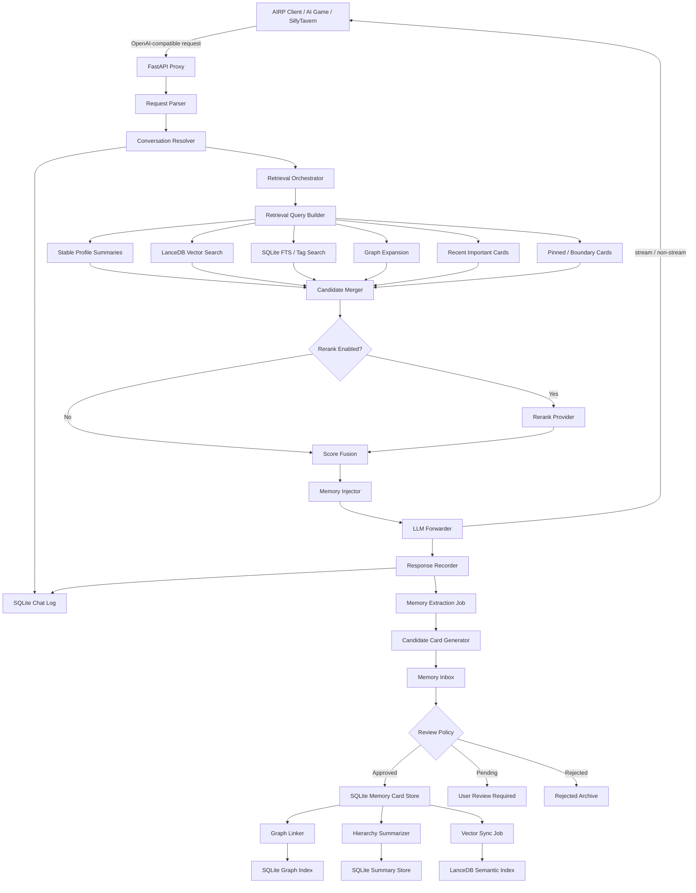

# KokoroMemo / 心忆 本地长期记忆核心工程文档

> 版本：v0.2-card-graph  
> 日期：2026-04-27  
> 目标读者：AI Agent、后续开发者、项目维护者  
> 默认技术路线：FastAPI + SQLite 记忆卡片库 + SQLite 图结构关系索引 + SQLite 层级摘要 + LanceDB 语义索引  
> 默认模型策略：Embedding 默认开启，Rerank 默认关闭  
> 记忆策略：半自动记忆、卡片化组织、双向链接、层级压缩、向量索引可重建  

---

## 0. 文档目的

本文档用于指导 AI Agent 施工 **KokoroMemo / 心忆**：一个面向 AIRP、AI 游戏、桌宠、SillyTavern 类客户端与其他 OpenAI-compatible 客户端的本地长期记忆核心。

KokoroMemo 不应被实现成“把聊天塞进向量库”的工具，而应被实现成一个 **卡片式、可审阅、可链接、可压缩、可重建索引的本地长期记忆系统**。

核心架构：

```text
FastAPI Proxy
  = OpenAI-compatible 本地代理

SQLite Chat Log
  = 完整对话、原始请求、原始响应、注入记录

SQLite Memory Card Store
  = 记忆本体：卡片、标签、版本、审核状态、事件记录

SQLite Graph Index
  = 卡片之间的 supports / constrains / contradicts / supersedes 等关系边

SQLite Hierarchy Store
  = L1/L3/L4 层级摘要、用户画像、角色画像、世界状态摘要

LanceDB Semantic Index
  = 对 approved 卡片和摘要的可重建语义索引
```

本次升级的核心目标：

1. 避免 AI 全自动记忆导致的记忆污染。
2. 避免把角色台词、临时情绪、模型幻觉当成长期事实。
3. 让用户可以查看、编辑、确认、拒绝、废弃长期记忆。
4. 让召回不只依赖向量相似度，还能利用标签、图关系和层级摘要。
5. 保留 SQLite 作为唯一真相源，LanceDB 只作为可重建的索引。

---

## 1. v0.2 相对 v0.1 的关键升级

| 模块 | v0.1 | v0.2 |
| --- | --- | --- |
| 记忆本体 | `memories` 表 | `memory_cards` 卡片库 |
| 向量库定位 | 核心记忆存储 | 语义索引，可重建 |
| 记忆写入 | 自动提炼后入库 | 候选卡片进入审核队列，默认半自动 |
| 召回方式 | 向量召回为主 | 向量 + 标签 + FTS + 图扩展 + 层级摘要 + 时间权重 |
| 冲突处理 | 相似度 + 状态 | 卡片版本、关系边、冲突组、审核事件 |
| 长期压缩 | 简单 summary | L0-L4 层级压缩 |
| 用户控制 | 较弱 | 可审阅、可编辑、可拒绝、可废弃、可重建 |

核心定位调整：

```text
旧定位：SQLite + LanceDB 长期记忆代理

新定位：SQLite 记忆卡片库 + LanceDB 语义索引 + 图结构关系索引的本地长期记忆核心
```

---

## 2. 核心设计原则

### 2.1 记忆卡片是本体，向量只是视角

系统必须遵循：

```text
memory_cards = 记忆本体
memory_edges = 结构关系
memory_summaries = 层级压缩
LanceDB = cards / summaries 的语义索引
```

任何 LanceDB 表损坏、重建、换 Embedding 模型、换向量维度，都必须能从 SQLite 恢复。

### 2.2 完整对话不等于长期记忆

完整对话用于：

```text
回放
审计
引用来源
重建摘要
重新提炼
用户导出
```

长期记忆用于：

```text
保持角色连续性
记住用户偏好
记住关系状态
记住剧情状态
记住承诺与边界
```

不得把每轮完整聊天原样写入 LanceDB 作为长期记忆。

### 2.3 默认半自动，而不是完全自动

AIRP 场景中，AI 输出可能包含角色台词、幻想剧情、临时情绪、误会、玩笑、暧昧表达和模型幻觉。若完全自动入库，长期使用会逐渐污染记忆库。

默认策略：

```text
短期会话摘要：可自动生效
低风险事实：高置信度时可自动 approved
长期偏好：建议 pending_review
关系重大变化：默认 pending_review
用户边界 / 禁忌：高置信度可自动 approved，但必须可撤回
模型单方面编造：不得自动 approved
```

### 2.4 Graph 关系帮助召回约束

向量检索只能回答“什么语义相似”。图结构还需要回答：

```text
这条记忆受到哪条边界约束？
这条记忆是否被新记忆替代？
这条剧情事件属于哪个阶段摘要？
这条偏好是否和另一条偏好冲突？
召回到 A 时，是否必须同时带出 B？
```

因此，图关系必须进入召回链路，而不是只做可视化。

### 2.5 层级压缩是长期稳定性的核心

长期 AIRP 会话不应只依赖底层事件卡片。系统需要将原始对话逐步压缩：

```text
L0 原始消息
L1 小段对话摘要
L2 事件 / 偏好 / 关系卡片
L3 会话阶段摘要
L4 用户画像 / 角色画像 / 世界状态
```

召回时优先使用高层摘要确定方向，再用低层卡片补充细节。

### 2.6 失败可降级

代理职责优先级：

```text
能正常转发聊天 > 能完整落盘 > 能召回记忆 > 能提炼新记忆 > 能优化召回
```

记忆系统失败时，对话仍应继续。

---

## 3. 术语定义

| 术语 | 含义 |
| --- | --- |
| Memory Card / 记忆卡片 | 经过提炼的最小长期记忆单元，可审阅、可编辑、可引用来源 |
| Card Edge / 卡片关系边 | 两张卡片之间的结构关系，例如支持、约束、冲突、替代 |
| Memory Inbox / 记忆收件箱 | AI 自动提炼出的候选记忆进入的待审核区域 |
| Approved Card | 已确认可参与召回和注入的记忆卡片 |
| Pending Card | 待用户审核或待规则确认的候选记忆 |
| Deprecated Card | 已废弃但保留历史，不再参与默认召回 |
| Summary Node / 摘要节点 | 多张卡片或多段对话压缩后的高层摘要 |
| Semantic Index | LanceDB 中的向量检索索引，可从 SQLite 重建 |
| Scope | 记忆作用域：global、character、conversation、world |
| Retrieval Route | 一种召回路径，例如向量召回、标签召回、图扩展、层级摘要召回 |

---

## 4. 系统目标与非目标

### 4.1 目标

- 提供本地 OpenAI-compatible 代理服务。
- 支持 `/v1/chat/completions`。
- 支持流式与非流式响应。
- 支持完整对话落盘。
- 支持记忆卡片库。
- 支持记忆候选收件箱与审核状态。
- 支持标签、双向链接与关系边。
- 支持层级压缩摘要。
- 支持 LanceDB 语义索引。
- 支持向量检索、标签检索、图扩展、摘要召回。
- 支持可选 Rerank。
- 支持多用户、多角色、多会话、多作用域隔离。
- 支持向量索引重建。
- 支持 Embedding / Rerank / LLM Provider 替换。
- 支持用户查看、编辑、拒绝、删除、废弃记忆。
- 支持健康检查与配置校验。

### 4.2 可选目标

v0.2 阶段可选目标：

- 完整图形化管理界面。
- 云端多人协作。
- 复杂权限系统。
- 多设备同步。
- 内置聊天模型。
- 自动读取游戏内部状态。
- 外部图数据库。
- 完整插件市场。

---

## 5. 总体架构



---

## 6. 推荐目录结构

```text
kokoromemo/
  README.md
  pyproject.toml
  config.example.yaml
  .env.example

  app/
    main.py

    api/
      routes_openai.py
      routes_admin.py
      routes_review.py
      routes_memory.py
      routes_health.py
      schemas_openai.py
      schemas_memory.py

    core/
      config.py
      logging.py
      errors.py
      ids.py
      time.py
      security.py
      json_schema.py

    proxy/
      request_parser.py
      conversation_resolver.py
      llm_forwarder.py
      stream_forwarder.py
      response_collector.py
      openai_compat.py

    memory/
      card_schema.py
      card_service.py
      inbox_service.py
      query_builder.py
      retrieval_orchestrator.py
      retriever_vector.py
      retriever_tag.py
      retriever_graph.py
      retriever_summary.py
      retriever_recent.py
      scorer.py
      injector.py
      extractor.py
      review_policy.py
      conflict.py
      graph_linker.py
      hierarchy.py
      decay.py
      dedupe.py
      policies.py

    providers/
      embedding_base.py
      embedding_modelark.py
      embedding_openai_compatible.py
      embedding_dummy.py
      rerank_base.py
      rerank_modelark.py
      rerank_openai_compatible.py
      rerank_none.py
      llm_base.py
      llm_openai_compatible.py

    storage/
      sqlite_app.py
      sqlite_conversation.py
      sqlite_memory.py
      sqlite_graph.py
      sqlite_summary.py
      lancedb_store.py
      migrations.py
      rebuild.py

    jobs/
      queue.py
      worker.py
      memory_extract_job.py
      vector_sync_job.py
      vector_rebuild_job.py
      graph_link_job.py
      hierarchy_summary_job.py

    cli/
      review.py
      rebuild.py
      export.py

  tests/
    test_openai_proxy.py
    test_streaming.py
    test_sqlite_schema.py
    test_memory_card.py
    test_memory_inbox.py
    test_graph_edges.py
    test_hierarchy_summary.py
    test_lancedb_store.py
    test_memory_retrieval.py
    test_memory_injection.py
    test_rebuild.py

  data/
    app.sqlite
    config.local.yaml

    conversations/
      conv_20260427_001/
        chat.sqlite
        export.jsonl
        attachments/

    memory/
      memory.sqlite

    vector_indexes/
      qwen3_embedding_4096/
        lancedb/
          kokoromemo.lance/
```

---

## 7. 配置文件设计

### 7.1 `config.example.yaml`

```yaml
server:
  host: "127.0.0.1"
  port: 8000
  log_level: "INFO"
  allow_remote_access: false

llm:
  provider: "openai_compatible"
  base_url: "https://api.example.com/v1"
  api_key: ""
  api_key_env: "LLM_API_KEY"
  model: "your-chat-model"
  timeout_seconds: 120

embedding:
  enabled: true
  provider: "modelark"
  base_url: "https://ark.cn-beijing.volces.com/api/v3"
  api_key_env: "MODELARK_API_KEY"
  model: "qwen3-embedding-8b"
  dimension: 4096
  timeout_seconds: 8
  batch_size: 16
  normalize: true

rerank:
  enabled: false
  provider: "modelark"
  base_url: "https://ark.cn-beijing.volces.com/api/v3"
  api_key_env: "MODELARK_API_KEY"
  model: "qwen3-reranker-8b"
  timeout_seconds: 8
  candidate_top_k: 40
  final_top_k: 8

memory:
  enabled: true
  inject_enabled: true
  extraction_enabled: true

  review:
    mode: "semi_auto"  # strict_manual | semi_auto | permissive_auto
    default_candidate_status: "pending_review"
    auto_approve_low_risk: true
    auto_approve_min_importance: 0.70
    auto_approve_min_confidence: 0.85
    require_review_types:
      - "relationship"
      - "boundary"
      - "world_state"
      - "character_state"
    never_auto_approve_if_from_assistant_only: true

  query:
    max_recent_turns_for_query: 6
    include_system_prompt_summary: true
    include_recent_injected_memories: true

  retrieval:
    final_top_k: 8
    max_injected_chars: 1800

    vector_top_k: 40
    tag_top_k: 20
    summary_top_k: 6
    graph_expand_top_k: 12
    recent_top_k: 6
    pinned_top_k: 8

    include_global: true
    include_character: true
    include_conversation: true
    include_world: true

    enable_vector_search: true
    enable_tag_search: true
    enable_fts_search: true
    enable_graph_expansion: true
    enable_hierarchy_summary: true
    enable_recent_important: true
    enable_pinned_cards: true

  scoring:
    vector_weight: 0.35
    keyword_weight: 0.10
    graph_weight: 0.15
    summary_weight: 0.10
    importance_weight: 0.12
    recency_weight: 0.08
    scope_weight: 0.05
    confidence_weight: 0.05

  extraction:
    extract_after_each_turn: true
    extract_every_n_turns: 1
    fallback_rule_based: true
    min_importance: 0.45
    min_confidence: 0.55
    create_edges: true
    create_tags: true
    create_summary_candidates: true

  hierarchy:
    enabled: true
    l1_turn_summary_enabled: true
    l3_session_summary_every_n_turns: 20
    l4_profile_summary_every_n_cards: 30
    max_summary_chars:
      l1: 400
      l3: 1200
      l4: 2000

  graph:
    enabled: true
    auto_link_enabled: true
    max_expansion_depth: 1
    max_neighbors_per_card: 4
    allowed_expansion_edges:
      - "constrains"
      - "supports"
      - "elaborates"
      - "continues"
      - "belongs_to"
      - "supersedes"
    inject_contradictions_as_warnings: true

storage:
  root_dir: "./data"
  sqlite:
    app_db: "./data/app.sqlite"
    memory_db: "./data/memory/memory.sqlite"
    journal_mode: "WAL"
    busy_timeout_ms: 5000
  lancedb:
    path: "./data/vector_indexes/qwen3_embedding_4096/lancedb"
    table: "kokoromemo_index"
    vector_column: "vector"
    text_column: "index_text"
    metric: "cosine"
    create_fts_index: true

compatibility:
  expose_v1_models: true
  expose_root_chat_completions: true
  cors_enabled: true

privacy:
  store_raw_conversation: true
  allow_remote_embedding: true
  allow_remote_rerank: true
  allow_remote_memory_extraction: true
  redact_api_keys_in_logs: true
```

### 7.2 `.env.example`

```bash
LLM_API_KEY=""
MODELARK_API_KEY=""
ADMIN_TOKEN=""
```

---

## 8. OpenAI-compatible 接口设计

### 8.1 必须实现的路由

```text
GET  /health
GET  /v1/models
POST /v1/chat/completions
POST /chat/completions
```

`POST /chat/completions` 是兼容路由，部分客户端可能省略 `/v1`。

### 8.2 请求处理原则

收到客户端请求后：

1. 保留原始 JSON。
2. 解析 `messages`。
3. 识别 `stream`。
4. 不丢弃未知字段。
5. 只修改 `messages` 或必要的 model 字段。
6. 其余字段原样转发给真实 LLM。

应原样透传：

```text
model
temperature
top_p
max_tokens
stream
stop
presence_penalty
frequency_penalty
tools
tool_choice
response_format
seed
logprobs
top_logprobs
stream_options
```

---

## 9. 会话识别与隔离

### 9.1 识别输入优先级

```text
1. Header: X-Conversation-Id
2. Header: X-Character-Id
3. Body: metadata.conversation_id
4. Body: user
5. 客户端 IP + model + system prompt hash + 首轮时间
6. default_conversation
```

### 9.2 建议 Header

```http
X-User-Id: default
X-Character-Id: yuki
X-Conversation-Id: conv_yuki_001
X-Client-Name: imouto-story
```

### 9.3 记忆作用域

```text
global       = 用户全局记忆，跨角色可用
character    = 当前角色记忆，跨该角色多个会话可用
conversation = 当前会话记忆，只在本会话使用
world        = 世界观 / 角色卡 / 场景设定层记忆
```

召回过滤建议：

```sql
status = 'approved'
AND user_id = :user_id
AND (
  scope = 'global'
  OR (scope = 'world' AND world_id = :world_id)
  OR (scope = 'character' AND character_id = :character_id)
  OR (scope = 'conversation' AND conversation_id = :conversation_id)
)
```

---

## 10. SQLite 拆分策略

推荐三个层级：

```text
app.sqlite                         # 全局注册表、配置、Provider、迁移版本
memory.sqlite                      # 记忆卡片库、图结构关系、层级摘要、审核队列、任务队列
conversations/*/chat.sqlite         # 每个会话完整聊天日志
```

SQLite 初始化：

```sql
PRAGMA journal_mode = WAL;
PRAGMA synchronous = NORMAL;
PRAGMA foreign_keys = ON;
PRAGMA busy_timeout = 5000;
```

---

## 11. `app.sqlite` schema

```sql
CREATE TABLE IF NOT EXISTS schema_migrations (
  version INTEGER PRIMARY KEY,
  name TEXT NOT NULL,
  applied_at TEXT NOT NULL
);

CREATE TABLE IF NOT EXISTS users (
  user_id TEXT PRIMARY KEY,
  display_name TEXT,
  created_at TEXT NOT NULL,
  updated_at TEXT NOT NULL
);

CREATE TABLE IF NOT EXISTS worlds (
  world_id TEXT PRIMARY KEY,
  user_id TEXT NOT NULL,
  title TEXT,
  description TEXT,
  created_at TEXT NOT NULL,
  updated_at TEXT NOT NULL
);

CREATE TABLE IF NOT EXISTS characters (
  character_id TEXT PRIMARY KEY,
  user_id TEXT NOT NULL,
  display_name TEXT,
  system_prompt_hash TEXT,
  world_id TEXT,
  created_at TEXT NOT NULL,
  updated_at TEXT NOT NULL
);

CREATE TABLE IF NOT EXISTS conversations (
  conversation_id TEXT PRIMARY KEY,
  user_id TEXT NOT NULL,
  character_id TEXT,
  world_id TEXT,
  client_name TEXT,
  title TEXT,
  path TEXT NOT NULL,
  first_seen_at TEXT NOT NULL,
  last_seen_at TEXT NOT NULL,
  status TEXT NOT NULL DEFAULT 'active'
);

CREATE TABLE IF NOT EXISTS provider_configs (
  provider_id TEXT PRIMARY KEY,
  provider_type TEXT NOT NULL,
  base_url TEXT,
  model TEXT,
  dimension INTEGER,
  enabled INTEGER NOT NULL DEFAULT 1,
  created_at TEXT NOT NULL,
  updated_at TEXT NOT NULL
);

CREATE TABLE IF NOT EXISTS vector_index_registry (
  index_id TEXT PRIMARY KEY,
  embedding_provider TEXT NOT NULL,
  embedding_model TEXT NOT NULL,
  embedding_dimension INTEGER NOT NULL,
  lancedb_path TEXT NOT NULL,
  table_name TEXT NOT NULL,
  status TEXT NOT NULL DEFAULT 'active',
  created_at TEXT NOT NULL,
  updated_at TEXT NOT NULL
);
```

---

## 12. 每个 `chat.sqlite` schema

```sql
CREATE TABLE IF NOT EXISTS turns (
  turn_id TEXT PRIMARY KEY,
  conversation_id TEXT NOT NULL,
  user_id TEXT NOT NULL,
  character_id TEXT,
  world_id TEXT,
  request_id TEXT NOT NULL,
  turn_index INTEGER NOT NULL,
  created_at TEXT NOT NULL
);

CREATE TABLE IF NOT EXISTS messages (
  message_id TEXT PRIMARY KEY,
  turn_id TEXT NOT NULL,
  conversation_id TEXT NOT NULL,
  role TEXT NOT NULL,
  name TEXT,
  content TEXT,
  raw_json TEXT,
  token_estimate INTEGER,
  created_at TEXT NOT NULL,
  FOREIGN KEY(turn_id) REFERENCES turns(turn_id)
);

CREATE TABLE IF NOT EXISTS raw_requests (
  request_id TEXT PRIMARY KEY,
  conversation_id TEXT NOT NULL,
  body_json TEXT NOT NULL,
  headers_json TEXT,
  created_at TEXT NOT NULL
);

CREATE TABLE IF NOT EXISTS raw_responses (
  response_id TEXT PRIMARY KEY,
  request_id TEXT NOT NULL,
  conversation_id TEXT NOT NULL,
  body_json TEXT,
  stream_text TEXT,
  finish_reason TEXT,
  error_json TEXT,
  created_at TEXT NOT NULL
);

CREATE TABLE IF NOT EXISTS injected_memory_logs (
  id TEXT PRIMARY KEY,
  request_id TEXT NOT NULL,
  conversation_id TEXT NOT NULL,
  injected_cards_json TEXT,
  injected_summaries_json TEXT,
  injected_text TEXT,
  created_at TEXT NOT NULL
);

CREATE VIRTUAL TABLE IF NOT EXISTS messages_fts USING fts5(
  content,
  role,
  content='messages',
  content_rowid='rowid'
);
```

---

## 13. `memory.sqlite` schema：记忆卡片库

### 13.1 `memory_cards`

```sql
CREATE TABLE IF NOT EXISTS memory_cards (
  card_id TEXT PRIMARY KEY,

  user_id TEXT NOT NULL,
  character_id TEXT,
  conversation_id TEXT,
  world_id TEXT,
  scope TEXT NOT NULL,

  title TEXT NOT NULL,
  content TEXT NOT NULL,
  summary TEXT,

  card_type TEXT NOT NULL,
  status TEXT NOT NULL DEFAULT 'pending_review',
  review_status TEXT NOT NULL DEFAULT 'pending',
  review_mode TEXT NOT NULL DEFAULT 'semi_auto',

  importance REAL NOT NULL DEFAULT 0.5,
  confidence REAL NOT NULL DEFAULT 0.7,
  stability REAL NOT NULL DEFAULT 0.5,
  sensitivity TEXT NOT NULL DEFAULT 'normal',

  source_turn_ids_json TEXT,
  source_message_ids_json TEXT,
  source_card_ids_json TEXT,
  evidence_text TEXT,

  created_by TEXT NOT NULL DEFAULT 'extractor',
  approved_by TEXT,
  approved_at TEXT,

  created_at TEXT NOT NULL,
  updated_at TEXT NOT NULL,
  last_accessed_at TEXT,
  access_count INTEGER NOT NULL DEFAULT 0,
  expires_at TEXT,

  supersedes_card_id TEXT,
  conflict_group_id TEXT,

  embedding_provider TEXT,
  embedding_model TEXT,
  embedding_dimension INTEGER,
  vector_index_id TEXT,
  vector_synced INTEGER NOT NULL DEFAULT 0,
  vector_synced_at TEXT
);

CREATE INDEX IF NOT EXISTS idx_cards_scope
ON memory_cards(user_id, character_id, conversation_id, world_id, scope, status);

CREATE INDEX IF NOT EXISTS idx_cards_review
ON memory_cards(review_status, status, created_at);

CREATE INDEX IF NOT EXISTS idx_cards_type
ON memory_cards(card_type, status);

CREATE INDEX IF NOT EXISTS idx_cards_embedding
ON memory_cards(embedding_model, embedding_dimension, vector_synced);
```

### 13.2 `memory_card_versions`

```sql
CREATE TABLE IF NOT EXISTS memory_card_versions (
  version_id TEXT PRIMARY KEY,
  card_id TEXT NOT NULL,
  version_number INTEGER NOT NULL,
  title TEXT NOT NULL,
  content TEXT NOT NULL,
  summary TEXT,
  tags_json TEXT,
  change_reason TEXT,
  changed_by TEXT NOT NULL,
  created_at TEXT NOT NULL,
  FOREIGN KEY(card_id) REFERENCES memory_cards(card_id)
);
```

### 13.3 `memory_card_events`

```sql
CREATE TABLE IF NOT EXISTS memory_card_events (
  event_id TEXT PRIMARY KEY,
  card_id TEXT NOT NULL,
  event_type TEXT NOT NULL,
  payload_json TEXT,
  created_at TEXT NOT NULL,
  FOREIGN KEY(card_id) REFERENCES memory_cards(card_id)
);
```

事件类型：

```text
created
auto_approved
review_approved
review_rejected
edited
deprecated
deleted
retrieved
injected
vector_synced
conflict_detected
merged
superseded
```

---

## 14. `memory.sqlite` schema：标签系统

```sql
CREATE TABLE IF NOT EXISTS memory_tags (
  tag_id TEXT PRIMARY KEY,
  user_id TEXT NOT NULL,
  name TEXT NOT NULL,
  normalized_name TEXT NOT NULL,
  parent_tag_id TEXT,
  description TEXT,
  created_at TEXT NOT NULL,
  updated_at TEXT NOT NULL
);

CREATE UNIQUE INDEX IF NOT EXISTS idx_tags_unique
ON memory_tags(user_id, normalized_name);

CREATE TABLE IF NOT EXISTS memory_card_tags (
  card_id TEXT NOT NULL,
  tag_id TEXT NOT NULL,
  weight REAL NOT NULL DEFAULT 1.0,
  source TEXT NOT NULL DEFAULT 'auto',
  created_at TEXT NOT NULL,
  PRIMARY KEY(card_id, tag_id),
  FOREIGN KEY(card_id) REFERENCES memory_cards(card_id),
  FOREIGN KEY(tag_id) REFERENCES memory_tags(tag_id)
);
```

标签示例：

```text
用户偏好
称呼
边界
关系状态
剧情事件
承诺
世界观
角色状态
当前目标
禁忌
情绪倾向
互动风格
```

---

## 15. `memory.sqlite` schema：图结构关系索引

### 15.1 `memory_edges`

```sql
CREATE TABLE IF NOT EXISTS memory_edges (
  edge_id TEXT PRIMARY KEY,

  source_card_id TEXT NOT NULL,
  target_card_id TEXT NOT NULL,

  edge_type TEXT NOT NULL,
  direction TEXT NOT NULL DEFAULT 'directed',
  weight REAL NOT NULL DEFAULT 1.0,
  confidence REAL NOT NULL DEFAULT 0.7,

  source TEXT NOT NULL DEFAULT 'auto',
  status TEXT NOT NULL DEFAULT 'active',

  evidence_text TEXT,
  created_at TEXT NOT NULL,
  updated_at TEXT NOT NULL,

  FOREIGN KEY(source_card_id) REFERENCES memory_cards(card_id),
  FOREIGN KEY(target_card_id) REFERENCES memory_cards(card_id)
);

CREATE INDEX IF NOT EXISTS idx_edges_source
ON memory_edges(source_card_id, edge_type, status);

CREATE INDEX IF NOT EXISTS idx_edges_target
ON memory_edges(target_card_id, edge_type, status);
```

### 15.2 关系边类型

| edge_type | 含义 | 检索用途 |
| --- | --- | --- |
| `supports` | A 支持 B | 召回 B 时可带出 A |
| `constrains` | A 约束 B | 召回 B 时必须考虑 A |
| `contradicts` | A 与 B 冲突 | 召回时做冲突警告或抑制旧卡 |
| `supersedes` | A 替代 B | 旧卡默认不注入 |
| `elaborates` | A 详细说明 B | 高层摘要召回后补充细节 |
| `summarizes` | A 总结 B | 低层卡片向高层摘要链接 |
| `derived_from` | A 来源于 B | 溯源 |
| `references` | A 引用 B | 可辅助扩展 |
| `continues` | A 延续 B | 剧情链路 |
| `belongs_to` | A 属于 B | 事件属于某阶段摘要或世界设定 |
| `same_as` | A 与 B 重复或等价 | 去重合并 |
| `causes` | A 导致 B | 剧情因果 |

### 15.3 双向链接策略

`memory_edges` 只存一条有向边。Graph Retriever 在读取时应根据 `edge_type` 决定是否反向扩展：

```text
supports：可双向弱扩展
constrains：从被约束卡片强制扩展到约束卡片
contradicts：双向可见，但默认不注入旧冲突卡
supersedes：从旧卡跳到新卡，从新卡可查旧卡
elaborates：摘要到细节可扩展，细节到摘要可扩展
belongs_to：子卡到父摘要强扩展，父摘要到子卡弱扩展
```

---

## 16. `memory.sqlite` schema：层级摘要

```sql
CREATE TABLE IF NOT EXISTS memory_summaries (
  summary_id TEXT PRIMARY KEY,

  user_id TEXT NOT NULL,
  character_id TEXT,
  conversation_id TEXT,
  world_id TEXT,
  scope TEXT NOT NULL,

  level INTEGER NOT NULL,
  summary_type TEXT NOT NULL,

  title TEXT NOT NULL,
  content TEXT NOT NULL,

  status TEXT NOT NULL DEFAULT 'approved',
  importance REAL NOT NULL DEFAULT 0.6,
  confidence REAL NOT NULL DEFAULT 0.8,

  source_turn_ids_json TEXT,
  source_card_ids_json TEXT,
  source_summary_ids_json TEXT,

  created_at TEXT NOT NULL,
  updated_at TEXT NOT NULL,
  last_accessed_at TEXT,
  access_count INTEGER NOT NULL DEFAULT 0,

  embedding_provider TEXT,
  embedding_model TEXT,
  embedding_dimension INTEGER,
  vector_index_id TEXT,
  vector_synced INTEGER NOT NULL DEFAULT 0,
  vector_synced_at TEXT
);

CREATE INDEX IF NOT EXISTS idx_summaries_scope
ON memory_summaries(user_id, character_id, conversation_id, world_id, scope, level, status);
```

层级定义：

| Level | 名称 | 内容 |
| --- | --- | --- |
| L0 | 原始消息 | `chat.sqlite.messages` |
| L1 | 小段对话摘要 | 1-6 轮对话的短摘要 |
| L2 | 记忆卡片 | 偏好、事件、边界、关系、承诺 |
| L3 | 会话阶段摘要 | 一个剧情阶段或长期会话阶段 |
| L4 | 长期画像 | 用户画像、角色关系画像、世界状态 |

触发条件：

```text
L1：每 4-8 轮生成，可自动 approved
L2：每轮或每 N 轮提炼候选卡片，按审核策略处理
L3：每 20 轮或会话空闲时生成
L4：每新增 30 张 approved 卡片或用户手动触发
```

---

## 17. `memory.sqlite` schema：记忆收件箱与审核

### 17.1 `memory_inbox`

```sql
CREATE TABLE IF NOT EXISTS memory_inbox (
  inbox_id TEXT PRIMARY KEY,

  candidate_type TEXT NOT NULL, -- card | edge | summary
  payload_json TEXT NOT NULL,

  user_id TEXT NOT NULL,
  character_id TEXT,
  conversation_id TEXT,
  world_id TEXT,
  scope TEXT NOT NULL,

  suggested_action TEXT NOT NULL DEFAULT 'review',
  risk_level TEXT NOT NULL DEFAULT 'normal',
  reason TEXT,

  status TEXT NOT NULL DEFAULT 'pending',
  created_at TEXT NOT NULL,
  reviewed_at TEXT,
  reviewed_by TEXT,
  review_note TEXT
);

CREATE INDEX IF NOT EXISTS idx_inbox_status
ON memory_inbox(user_id, status, created_at);
```

### 17.2 审核动作

```text
approve
edit_and_approve
reject
merge_into_existing
mark_as_boundary
mark_as_temporary
ignore_once
ignore_similar
deprecate_existing_and_approve
```

### 17.3 `review_actions`

```sql
CREATE TABLE IF NOT EXISTS review_actions (
  action_id TEXT PRIMARY KEY,
  inbox_id TEXT NOT NULL,
  action TEXT NOT NULL,
  payload_json TEXT,
  created_at TEXT NOT NULL,
  FOREIGN KEY(inbox_id) REFERENCES memory_inbox(inbox_id)
);
```

---

## 18. `memory.sqlite` schema：任务队列

```sql
CREATE TABLE IF NOT EXISTS jobs (
  job_id TEXT PRIMARY KEY,
  job_type TEXT NOT NULL,
  status TEXT NOT NULL DEFAULT 'pending',
  payload_json TEXT NOT NULL,
  attempts INTEGER NOT NULL DEFAULT 0,
  last_error TEXT,
  created_at TEXT NOT NULL,
  updated_at TEXT NOT NULL,
  run_after TEXT
);

CREATE INDEX IF NOT EXISTS idx_jobs_status
ON jobs(status, run_after, created_at);
```

任务类型：

```text
memory_extract
card_vector_sync
summary_vector_sync
vector_rebuild
graph_link
hierarchy_summary
conflict_check
fts_rebuild
```

---

## 19. LanceDB 表设计

### 19.1 LanceDB 的角色

LanceDB 不保存记忆本体，只保存可重建的索引行。

索引对象包括：

```text
approved memory_cards
approved memory_summaries
必要时可索引 pinned boundary cards
```

不索引：

```text
pending_review cards
rejected cards
deleted cards
raw messages
未确认的 assistant-only 推断
```

### 19.2 物理索引命名

```text
data/vector_indexes/{embedding_model_slug}_{dimension}/lancedb/
```

例如：

```text
data/vector_indexes/qwen3_embedding_4096/lancedb/
```

### 19.3 默认表名

```text
kokoromemo_index
```

### 19.4 LanceDB 字段

```python
from lancedb.pydantic import LanceModel, Vector

class KokoroMemoIndexRow(LanceModel):
    item_id: str              # card_id 或 summary_id
    item_type: str            # card | summary

    user_id: str
    character_id: str | None
    conversation_id: str | None
    world_id: str | None
    scope: str

    title: str
    index_text: str
    content: str
    summary: str | None

    card_type: str | None
    summary_type: str | None
    level: int | None

    tags_json: str | None

    importance: float
    confidence: float
    status: str

    created_at: str
    updated_at: str
    last_accessed_at: str | None

    embedding_provider: str
    embedding_model: str
    embedding_dimension: int

    vector: Vector(4096)
```

### 19.5 `index_text` 构造

用于 embedding 的 `index_text` 应包含结构化信息：

```text
标题：{title}
类型：{card_type or summary_type}
作用域：{scope}
标签：{tags}
内容：{content}
摘要：{summary}
```

不要只 embedding `content`，否则标签、类型和标题的召回能力较弱。

---

## 20. Provider 抽象

### 20.1 EmbeddingProvider

```python
from abc import ABC, abstractmethod

class EmbeddingProvider(ABC):
    provider_name: str
    model: str
    dimension: int

    @abstractmethod
    async def embed_text(self, text: str) -> list[float]:
        pass

    async def embed_batch(self, texts: list[str]) -> list[list[float]]:
        return [await self.embed_text(t) for t in texts]

    @abstractmethod
    async def health_check(self) -> dict:
        pass
```

实现：

```text
ModelArkEmbeddingProvider
OpenAICompatibleEmbeddingProvider
DummyEmbeddingProvider
```

### 20.2 RerankProvider

```python
from abc import ABC, abstractmethod

class RerankProvider(ABC):
    provider_name: str
    model: str

    @abstractmethod
    async def rerank(self, query: str, documents: list[str]) -> list[tuple[int, float]]:
        pass

    @abstractmethod
    async def health_check(self) -> dict:
        pass
```

实现：

```text
ModelArkRerankProvider
OpenAICompatibleRerankProvider
NoRerankProvider
```

---

## 21. 请求处理流程

### 21.1 非流式流程

```text
1. 接收请求
2. 保存 raw request
3. 解析 messages
4. 解析 user_id / character_id / conversation_id / world_id
5. 构造 retrieval query
6. 多路召回：
   - 层级摘要召回
   - LanceDB 向量召回
   - SQLite FTS / Tag 召回
   - 图结构扩展
   - 最近重要卡片
   - pinned / boundary 卡片
7. 合并候选，去重，冲突过滤
8. 可选 Rerank
9. 综合评分
10. 构造分层记忆注入消息
11. 转发到真实 LLM
12. 接收完整响应
13. 保存 raw response
14. 保存 user / assistant message
15. 返回响应给客户端
16. 后台执行记忆提炼
17. 候选记忆进入 memory_inbox 或自动 approved
18. approved 项同步 LanceDB
19. 异步生成边关系与层级摘要
```

### 21.2 流式流程

```text
1. 接收请求
2. 保存 raw request
3. 解析与召回记忆
4. 注入记忆
5. 请求真实 LLM stream
6. 将 SSE chunk 原样转发给客户端
7. 同时旁路累积 assistant delta content
8. stream 结束后保存完整 assistant response
9. 后台执行记忆提炼、候选卡片生成、审核处理、向量同步
```

要求：

```text
不能等完整 LLM 回复生成后再返回客户端
必须边转发边收集
[DONE] 必须原样转发
出错时返回 OpenAI-compatible error JSON
```

---

## 22. 检索 Query 构造

不要只用最新一句话。

推荐 Query 模板：

```text
当前玩家发言：
{latest_user_message}

最近 {n} 轮上下文：
{recent_dialogue}

当前角色/系统设定摘要：
{system_prompt_summary}

最近注入过的记忆：
{recent_injected_memories}

检索目标：
寻找与当前回复最相关的长期记忆，包括玩家偏好、关系状态、重要承诺、剧情状态、称呼习惯、禁忌、边界、未解决事件和当前世界状态。
```

Query Builder 输入：

```python
@dataclass
class RetrievalQueryInput:
    user_id: str
    character_id: str | None
    conversation_id: str
    world_id: str | None
    messages: list[dict]
    max_recent_turns: int
    recent_injected_card_ids: list[str]
```

Query Builder 输出：

```python
@dataclass
class RetrievalQuery:
    query_text: str
    latest_user_text: str
    recent_context_text: str
    scope_filter: dict
    suggested_tags: list[str]
    intent_hints: list[str]
```

---

## 23. 多路召回设计

### 23.1 Route 1：层级摘要召回

目的：先拿到高层稳定背景。

候选：

```text
L4 用户画像
L4 角色关系画像
L4 世界状态
L3 当前会话阶段摘要
```

### 23.2 Route 2：LanceDB 向量召回

目的：语义相似召回。

流程：

```text
query_text -> embedding
LanceDB vector search top_k
metadata scope filter
返回 card / summary candidates
```

默认：

```text
vector_top_k = 40
```

### 23.3 Route 3：SQLite FTS / Tag 召回

目的：精确关键词、称呼、承诺、专有名词。

适合：

```text
生日
名字
约定
地名
道具名
特定剧情名
用户明确提到的关键词
```

### 23.4 Route 4：Graph Expansion

目的：召回约束、冲突、新旧版本、上下文邻居。

流程：

```text
1. 从向量 / 标签 / 摘要候选中选 seed cards
2. 查 memory_edges
3. 根据 edge_type 扩展一阶邻居
4. 对 constrains / supersedes / contradicts 做特殊处理
5. 加入候选池
```

边扩展规则：

```text
constrains：强制加入，作为约束
supersedes：如果召回旧卡，替换为新卡
contradicts：加入冲突提示，但不默认注入旧事实
elaborates：在预算允许时加入细节
belongs_to：加入父摘要或相关阶段
continues：加入剧情前后文
supports：弱加入
references：低权重加入
```

### 23.5 Route 5：Recent Important Cards

目的：补足近期重要事件。

```sql
status = 'approved'
AND importance >= 0.75
AND updated_at >= now - recent_window
```

默认：

```text
recent_window = 7 days
recent_top_k = 6
```

### 23.6 Route 6：Pinned / Boundary Cards

目的：固定注入用户边界、稳定偏好、禁忌。

```text
card_type = boundary
或 tags 包含 pinned / boundary / safety / user_preference
```

---

## 24. 候选合并、去重与评分

Candidate 结构：

```python
@dataclass
class MemoryCandidate:
    item_id: str
    item_type: str  # card | summary
    title: str
    content: str
    scope: str
    card_type: str | None
    summary_type: str | None
    level: int | None
    tags: list[str]
    importance: float
    confidence: float
    status: str
    route_scores: dict[str, float]
    final_score: float | None
    source_routes: list[str]
    edge_context: dict | None
```

去重规则：

```text
1. 同 item_id 去重
2. same_as 边合并
3. supersedes 边替换旧卡
4. title + content 高相似度合并
5. summary 与 card 同时出现时，保留 summary，细节卡根据预算补充
```

无 Rerank 综合评分：

```text
score =
  vector_score      * 0.35
+ keyword_score     * 0.10
+ graph_score       * 0.15
+ summary_score     * 0.10
+ importance        * 0.12
+ recency_score     * 0.08
+ scope_score       * 0.05
+ confidence        * 0.05
```

启用 Rerank：

```text
score =
  rerank_score      * 0.45
+ vector_score      * 0.15
+ keyword_score     * 0.08
+ graph_score       * 0.12
+ summary_score     * 0.07
+ importance        * 0.06
+ recency_score     * 0.03
+ scope_score       * 0.02
+ confidence        * 0.02
```

Scope 权重：

```text
conversation = 1.00
character    = 0.88
world        = 0.78
global       = 0.72
```

---

## 25. 记忆注入策略

### 25.1 注入位置

推荐在原 messages 中追加一条 system 消息，位于原始 system prompt 之后、最新 user 消息之前。

### 25.2 注入优先级

注入文本必须包含：

```text
优先级：安全规则 > 客户端原始 System Prompt > 当前用户明确发言 > 当前对话上下文 > KokoroMemo 长期记忆 > 模型自由发挥。
如果长期记忆与当前用户发言冲突，以当前用户发言为准。
不要主动说“我从记忆库看到”。
不要机械复述记忆。
```

### 25.3 分层注入模板

```text
【KokoroMemo 心忆】
以下内容来自用户本地长期记忆，用于帮助角色保持连续性。
这些记忆可能不完整或过期，不能覆盖系统规则、原始角色设定和当前用户明确发言。
请自然参考，不要提及“记忆库”“系统注入”或“检索结果”。

[稳定边界 / 禁忌]
- ...

[用户偏好]
- ...

[关系状态]
- ...

[当前剧情 / 会话状态]
- ...

[未完成承诺]
- ...

[当前相关记忆]
- ...

[注意]
如果记忆与当前对话冲突，以当前对话为准，并在回复中自然适应。
```

预算优先级：

```text
1. boundary / pinned
2. 当前 conversation 的高分事件
3. 当前 character 的关系状态
4. L4 画像摘要
5. 当前 query 相关卡片
6. global 偏好
```

---

## 26. 记忆提炼策略

### 26.1 提炼时机

```text
每轮结束后：生成候选卡片 / 候选边
每 4-8 轮：生成 L1 小段摘要
每 20 轮：生成 L3 会话阶段摘要
每 30 张 approved 卡片：刷新 L4 用户/角色画像
```

### 26.2 提炼输入

```text
当前 turn：
- user message
- assistant message

最近 4~8 轮上下文：
- role + content

已召回并注入的记忆：
- card_id / summary_id + content

已有相关卡片：
- 向量或标签召回的近似卡片

当前角色/会话 metadata：
- user_id
- character_id
- conversation_id
- world_id
```

### 26.3 提炼输出 JSON

```json
{
  "candidate_cards": [
    {
      "should_store": true,
      "title": "玩家偏好：轻度撒娇与吃醋",
      "scope": "character",
      "card_type": "preference",
      "content": "玩家喜欢 Yuki 偶尔撒娇和轻度吃醋，但不喜欢过度威胁或病态表达。",
      "summary": "玩家偏好轻度占有欲互动",
      "tags": ["用户偏好", "语气", "亲密互动", "边界"],
      "importance": 0.82,
      "confidence": 0.78,
      "stability": 0.74,
      "sensitivity": "normal",
      "expires_at": null,
      "evidence_text": "用户明确表示喜欢撒娇但不喜欢威胁式表达。",
      "suggested_status": "pending_review",
      "conflicts_with": [],
      "supersedes": []
    }
  ],
  "candidate_edges": [
    {
      "source_title": "玩家偏好：轻度撒娇与吃醋",
      "target_card_id": "card_existing_boundary_001",
      "edge_type": "constrains",
      "weight": 0.9,
      "confidence": 0.8,
      "evidence_text": "该偏好需要受到玩家边界约束。"
    }
  ],
  "candidate_summaries": []
}
```

### 26.4 可存储内容

应该存：

```text
用户长期偏好
用户称呼习惯
用户明确边界
角色关系状态
剧情进度
重要承诺
重要事件
世界状态
角色状态
用户明确纠正的信息
重复出现的互动模式
```

不应该存：

```text
一次性寒暄
纯玩笑
反讽
明显测试模型的话
模型自己编造但用户未确认的设定
临时情绪波动
无意义短句
容易过期的低价值细节
```

### 26.5 Assistant-only 规则

如果一条记忆完全来自 assistant 单方面陈述，且没有用户确认，则默认：

```text
status = pending_review
risk_level = high
不得自动 approved
```

例外：

```text
会话阶段摘要
当前对话中由系统 prompt 明确给定的角色设定
用户明确要求 AI 设定的剧情内容
```

---

## 27. 审核策略

### 27.1 审核模式

```text
strict_manual     = 所有候选长期记忆必须用户确认
semi_auto         = 默认模式，高置信低风险可自动通过，其余进入收件箱
permissive_auto   = 尽量自动通过，但仍保留收件箱和撤回能力
```

### 27.2 默认 semi_auto 规则

自动 approved 条件：

```text
importance >= 0.70
confidence >= 0.85
risk_level != high
不是 relationship / boundary / world_state / character_state 重大变化
不是 assistant-only 编造
没有与 active 卡片明显冲突
```

进入 pending_review 条件：

```text
关系重大变化
用户边界变化
角色设定变化
世界状态变化
置信度不足
检测到与旧卡冲突
来源不清晰
```

直接 rejected 条件：

```text
低价值寒暄
明显玩笑
明显幻觉
重复且无新增信息
违反用户 ignore_similar 策略
```

---

## 28. 记忆冲突与更新

### 28.1 冲突检测流程

```text
1. 用候选 content 做 embedding
2. 从同作用域召回相似 approved cards top 10
3. 查同 tag / 同 card_type 的旧卡
4. 判断关系：
   - duplicate
   - complement
   - contradiction
   - replacement
   - refinement
5. 生成 candidate_edges 或 review warning
```

### 28.2 处理策略

```text
duplicate：不新增，记录 event，必要时更新 access_count
complement：新增卡，并建立 elaborates / supports 边
contradiction：进入 pending_review，建立 contradicts 边
replacement：新卡 approved 后旧卡 status = superseded，建立 supersedes 边
refinement：创建新 version 或新卡，保留旧版本
```

卡片状态：

```text
draft
pending_review
approved
rejected
superseded
deprecated
deleted
archived
```

向量状态：

```text
vector_pending
vector_synced
vector_failed
vector_stale
```

---

## 29. 层级压缩策略

### 29.1 L1 小段摘要

每 4-8 轮对话生成：

```text
本段对话发生了什么
用户表达了什么偏好或边界
角色状态是否变化
是否出现承诺或未完成事件
```

L1 摘要可自动 approved，但只用于辅助压缩和检索，不一定直接注入。

### 29.2 L3 会话阶段摘要

每 20 轮或会话空闲时生成：

```text
当前剧情阶段
关系进展
未解决事件
已确认事实
重要情绪变化
```

L3 摘要参与召回。

### 29.3 L4 长期画像

按 user / character / world 生成：

```text
用户长期偏好画像
用户边界画像
角色与用户关系画像
角色状态摘要
世界状态摘要
```

L4 摘要在新会话开始或召回不足时优先注入。

### 29.4 摘要更新规则

```text
不得直接覆盖旧摘要
先生成新版本
保留 source_card_ids / source_summary_ids
旧摘要可标记 superseded
```

---

## 30. 图结构召回策略

### 30.1 Seed Cards

Graph expansion 的 seed 来自：

```text
向量召回 top cards
标签召回 top cards
最近重要卡片
pinned cards
摘要关联卡片
```

### 30.2 Depth

v0.2 默认：

```text
max_expansion_depth = 1
max_neighbors_per_card = 4
```

不建议默认深度 > 1，否则容易召回扩散。

### 30.3 强制扩展边

以下边类型默认强制考虑：

```text
constrains
supersedes
contradicts
belongs_to
```

例如召回“玩家喜欢轻度占有欲互动”时，如果它被“玩家不喜欢威胁、自残式表达”约束，必须把约束一起注入。

### 30.4 抑制规则

```text
如果旧卡被 supersedes，新卡存在且 approved，则旧卡不注入。
如果 cards 互相 contradicts，除非当前 query 明确需要冲突历史，否则只注入当前 approved / 较新 / 较高置信卡。
如果 related cards 超预算，优先保留 constrains 与 boundary。
```

---

## 31. 索引同步与重建

### 31.1 写入策略

当卡片 approved：

```text
1. 写入 memory_cards
2. 生成或更新 tags
3. 生成或更新 edges
4. 创建 card_vector_sync job
5. 调用 Embedding Provider
6. upsert 到 LanceDB
7. 更新 vector_synced = 1
```

当摘要 approved：

```text
1. 写入 memory_summaries
2. 创建 summary_vector_sync job
3. upsert 到 LanceDB
```

### 31.2 重建触发场景

```text
用户更换 embedding 模型
用户更换 embedding 维度
LanceDB 文件损坏
用户手动清理索引
schema 升级
批量导入旧聊天后重新提炼
卡片大量编辑后需要刷新
```

### 31.3 重建流程

```text
1. 读取 memory_cards 中 status = approved 的卡片
2. 读取 memory_summaries 中 status = approved 的摘要
3. 按 embedding_model / dimension 分组
4. 调用对应 EmbeddingProvider 批量向量化
5. 创建新的 LanceDB 目录，例如 qwen3_embedding_4096_tmp
6. 写入全部 index rows
7. 创建必要索引
8. 校验 row count
9. 原子切换 active index path
10. 旧索引改名备份或删除
```

---

## 32. Admin / Review API 设计

### 32.1 只读接口

```text
GET /admin/status
GET /admin/conversations
GET /admin/conversations/{conversation_id}
GET /admin/cards?user_id=&character_id=&conversation_id=&status=
GET /admin/cards/{card_id}
GET /admin/cards/{card_id}/edges
GET /admin/tags
GET /admin/summaries
GET /admin/inbox?status=pending
GET /admin/jobs
```

### 32.2 审核接口

```text
POST /admin/inbox/{inbox_id}/approve
POST /admin/inbox/{inbox_id}/edit-and-approve
POST /admin/inbox/{inbox_id}/reject
POST /admin/inbox/{inbox_id}/merge
POST /admin/inbox/{inbox_id}/ignore-similar
```

### 32.3 卡片写接口

```text
POST /admin/cards
PATCH /admin/cards/{card_id}
POST /admin/cards/{card_id}/deprecate
POST /admin/cards/{card_id}/delete
POST /admin/cards/{card_id}/pin
POST /admin/cards/{card_id}/unpin
```

### 32.4 图结构写接口

```text
POST /admin/cards/{card_id}/edges
DELETE /admin/edges/{edge_id}
PATCH /admin/edges/{edge_id}
```

### 32.5 维护接口

```text
POST /admin/rebuild-vector-index
POST /admin/rebuild-fts
POST /admin/rebuild-summaries
POST /admin/export/conversation/{conversation_id}
POST /admin/export/character/{character_id}
```

所有 `/admin/*` 接口必须要求：

```http
Authorization: Bearer {ADMIN_TOKEN}
```

---

## 33. 健康检查

### 33.1 `/health`

```json
{
  "status": "ok",
  "server": "ok",
  "sqlite": {
    "app": "ok",
    "memory": "ok",
    "conversations": "ok"
  },
  "lancedb": "ok",
  "embedding": {
    "enabled": true,
    "status": "ok",
    "model": "qwen3-embedding-8b",
    "dimension": 4096
  },
  "rerank": {
    "enabled": false,
    "status": "disabled"
  },
  "llm": {
    "status": "ok",
    "model": "your-chat-model"
  },
  "memory": {
    "approved_cards": 0,
    "pending_inbox": 0,
    "summaries": 0,
    "edges": 0,
    "vector_unsynced": 0
  }
}
```

### 33.2 启动校验

启动时必须检查：

```text
配置文件可读
数据目录可写
SQLite 可连接
WAL PRAGMA 设置成功
LanceDB 可连接或可创建
Embedding Provider 可调用
Embedding 返回维度与配置一致
Rerank 如果启用则可调用
LLM Provider 至少 base_url 和 key 存在
memory_cards schema 版本正确
LanceDB index 与 embedding 配置匹配
```

如果 Embedding 不可用：

```text
长期记忆模块进入 degraded 模式
聊天代理仍然可用
/health 返回 warning
```

---

## 34. 错误处理

原则：

```text
记忆系统失败，不应导致聊天失败。
LLM 转发失败，才返回客户端错误。
```

错误等级：

```text
fatal：服务无法启动
request_error：当前请求失败
memory_degraded：记忆召回失败，但聊天继续
review_degraded：候选记忆无法进入收件箱
background_error：后台任务失败，写入 jobs 重试
```

超时建议：

```text
Embedding timeout: 8s
Rerank timeout: 8s
LanceDB query timeout: 3s
SQLite FTS timeout: 1s
Graph expansion timeout: 1s
LLM request timeout: 120s
Memory extraction timeout: 30s
Hierarchy summary timeout: 60s
```

若某一路召回超时：

```text
跳过该 route
保留其他 route 结果
若全部失败，则不注入记忆，继续聊天
```

---

## 35. 并发与文件锁

### 35.1 SQLite

```text
启用 WAL
每个请求使用短事务
写入队列尽量串行化
避免长时间持有写事务
后台任务写入失败时重试
```

### 35.2 LanceDB

```text
v0.2 推荐单进程运行
后台向量写入通过 job queue 串行化
检索可并发
重建索引时写入临时目录，完成后切换
```

### 35.3 多客户端连接

多个 AIRP 会话可以同时连到本地代理。必须通过：

```text
user_id
character_id
conversation_id
world_id
scope
```

逻辑隔离，避免记忆串线。

---

## 36. 安全与隐私

默认只监听本机：

```yaml
server:
  host: "127.0.0.1"
```

API Key 保护：

```text
不把 API Key 写入日志
配置文件支持 api_key_env
.env 不提交 Git
错误信息不得回显完整 Key
```

用户必须能够：

```text
查看记忆卡片
编辑记忆卡片
拒绝候选记忆
删除记忆卡片
废弃旧记忆
查看记忆来源
导出某个会话
导出某个角色的记忆
重建向量索引
清理 deleted / deprecated 索引
```

如果用户配置远程 Embedding、Rerank 或记忆提炼模型，相关文本可能会发送到远程 API。配置必须明确：

```yaml
privacy:
  allow_remote_embedding: true
  allow_remote_rerank: true
  allow_remote_memory_extraction: true
```

---

## 37. 日志设计

日志字段：

```json
{
  "time": "2026-04-27T22:00:00+09:00",
  "level": "INFO",
  "request_id": "req_xxx",
  "conversation_id": "conv_xxx",
  "character_id": "yuki",
  "event": "memory_retrieved",
  "routes": {
    "vector": 12,
    "tag": 3,
    "graph": 4,
    "summary": 2
  },
  "final_count": 7,
  "latency_ms": 83
}
```

禁止：

```text
默认不记录完整用户消息和完整 assistant 回复到普通日志。
完整内容只写入 SQLite。
```

---

## 38. 关键模块施工说明

### 38.1 `routes_openai.py`

职责：

```text
暴露 /v1/chat/completions
判断 stream
调用 proxy pipeline
返回 JSONResponse 或 StreamingResponse
```

### 38.2 `conversation_resolver.py`

职责：

```text
解析 user_id / character_id / conversation_id / world_id
创建会话目录
初始化 chat.sqlite
更新 app.sqlite conversations 表
```

### 38.3 `retrieval_orchestrator.py`

职责：

```text
调用 query_builder
调度 vector / tag / graph / summary / recent / pinned 多路召回
合并候选
调用 rerank
调用 scorer
返回最终候选
```

### 38.4 `retriever_graph.py`

职责：

```text
以 seed cards 为中心查询 memory_edges
根据 edge_type 扩展邻居
处理 supersedes / contradicts / constrains
返回 graph candidates
```

### 38.5 `retriever_summary.py`

职责：

```text
召回 L3 / L4 摘要
按 scope 和 query 筛选
为后续 vector / graph 提供高层上下文
```

### 38.6 `injector.py`

职责：

```text
将候选卡片和摘要格式化为分层 memory block
控制最大条数和字数
插入 messages
记录 injected_memory_logs
```

### 38.7 `extractor.py`

职责：

```text
根据本轮对话生成 candidate_cards / candidate_edges / candidate_summaries
校验 JSON schema
过滤低 confidence / 低 importance
发送到 inbox_service
```

### 38.8 `inbox_service.py`

职责：

```text
根据 review_policy 决定 auto approve / pending / reject
保存 memory_inbox
处理用户审核动作
```

### 38.9 `card_service.py`

职责：

```text
创建 / 更新 / 审核 / 废弃 / 删除 memory_cards
写 memory_card_versions
写 memory_card_events
创建 vector_sync job
```

### 38.10 `graph_linker.py`

职责：

```text
为新卡片寻找相似卡片
判断重复、补充、冲突、替代、约束
生成 memory_edges 或 pending edge candidates
```

### 38.11 `hierarchy.py`

职责：

```text
生成 L1 / L3 / L4 摘要
维护 summary 版本
把 summary 与 cards 建立 summarizes / belongs_to 边
```

### 38.12 `lancedb_store.py`

职责：

```text
connect LanceDB
create/open table
upsert card / summary index rows
search vector
optional full-text / hybrid search
delete/deprecate rows
```

### 38.13 `rebuild.py`

职责：

```text
从 SQLite 读取 approved cards / summaries
批量 embedding
新建 LanceDB index
校验
切换
```

---

## 39. MVP 范围

### 39.1 v0.2 MVP 必须实现

```text
FastAPI 服务
/v1/models
/v1/chat/completions 非流式代理
/v1/chat/completions 流式代理
SQLite 完整对话落盘
memory_cards schema
memory_inbox schema
memory_edges schema
memory_summaries schema
EmbeddingProvider 抽象
ModelArk Embedding Provider
NoRerankProvider
LanceDB index table
approved cards 向量检索
基础记忆注入
规则记忆提炼
候选记忆进入 inbox
简易 auto approve 策略
从 SQLite 重建 LanceDB
/health
```

### 39.2 v0.2 MVP 可以暂缓

```text
完整图形化 UI
复杂 LLM 记忆提炼
复杂冲突判断
复杂层级摘要
LanceDB hybrid search
Rerank Provider
多 Provider 图形配置
复杂图聚类
```

### 39.3 MVP 验收标准

1. 兼容客户端能通过本地代理正常聊天。
2. `stream=true` 时客户端能看到流式输出。
3. 每轮对话写入对应 `chat.sqlite`。
4. 用户表达“以后你叫我哥哥”后，系统生成候选卡片。
5. 候选卡片进入 `memory_inbox`。
6. 用户 approve 后，卡片进入 `memory_cards`，并同步 LanceDB。
7. 后续用户问“你该怎么叫我”，系统能召回并注入该卡片。
8. 删除 LanceDB 目录后，运行重建命令可恢复检索能力。
9. Rerank 关闭时系统正常运行。
10. Embedding API 短暂失败时，聊天不中断，只是不注入记忆。
11. 手动把旧卡标记为 deprecated 后，默认不再注入。
12. 召回到被 `constrains` 约束的卡片时，约束卡片也能被带出。

---

## 40. 分阶段开发计划

### Phase 0：项目骨架

```text
创建目录结构
初始化 FastAPI
加载 config
日志模块
health route
SQLite migration 框架
```

### Phase 1：OpenAI-compatible 代理

```text
/v1/models
非流式 /v1/chat/completions 转发
流式转发
保留未知字段
OpenAI-compatible error
```

### Phase 2：完整对话落盘

```text
app.sqlite
conversation resolver
每个会话 chat.sqlite
raw request / response / messages
injected_memory_logs
```

### Phase 3：卡片库与收件箱

```text
memory_cards
memory_card_versions
memory_card_events
memory_inbox
review_actions
基础 Admin / CLI 审核
```

### Phase 4：Embedding + LanceDB

```text
EmbeddingProvider
ModelArk Embedding
LanceDBStore
approved cards upsert
vector search
重建索引
```

### Phase 5：基础召回与注入

```text
Query Builder
Vector Retriever
Pinned / Boundary Retriever
Scorer
Injector
```

### Phase 6：规则提炼与半自动审核

```text
规则提炼
JSON schema
review_policy
auto approve / pending / reject
卡片 approve 后向量同步
```

### Phase 7：图结构关系

```text
memory_edges
graph_linker
graph retriever
constrains / supersedes / contradicts 处理
```

### Phase 8：层级压缩

```text
L1 小段摘要
L3 会话阶段摘要
L4 用户/角色画像
summary vector sync
summary retriever
```

### Phase 9：增强检索

```text
SQLite FTS
Tag Retriever
LanceDB FTS / hybrid
可选 Rerank
RRF 或自定义融合
```

### Phase 10：管理界面

```text
查看卡片
审核 inbox
编辑卡片
查看图关系
重建索引
导出数据
```

---

## 41. 测试计划

### 41.1 单元测试

```text
test_config_load
test_id_sanitize
test_openai_request_parse
test_conversation_resolve
test_sqlite_write_read
test_memory_card_create
test_memory_card_version
test_memory_inbox_approve
test_memory_inbox_reject
test_memory_edge_create
test_graph_expand_constrains
test_graph_expand_supersedes
test_hierarchy_summary_create
test_embedding_dimension_check
test_lancedb_upsert_search
test_memory_score
test_memory_injection_char_limit
test_no_rerank_provider
```

### 41.2 集成测试

```text
非流式代理成功
流式代理成功
Embedding 失败但聊天继续
LanceDB 空库时聊天继续
候选卡片进入 inbox
approve 后可召回
切换会话不会召回错误 conversation scope
同角色跨会话可召回 character scope
global 偏好跨角色可召回
deprecated 卡片默认不召回
supersedes 边能替换旧卡
constrains 边能带出约束卡
重建索引后召回结果一致
```

---

## 42. 参考实现伪代码

### 42.1 主入口

```python
@app.post("/v1/chat/completions")
async def chat_completions(request: Request, background_tasks: BackgroundTasks):
    raw_body = await request.json()
    ctx = await parse_and_resolve_context(request, raw_body)

    await recorder.record_raw_request(ctx, raw_body, request.headers)

    if config.memory.enabled and config.memory.inject_enabled:
        retrieval_query = await query_builder.build(ctx, raw_body["messages"])
        candidates = await retrieval_orchestrator.retrieve(ctx, retrieval_query)
        injected_messages, injection_log = memory_injector.inject(
            raw_body["messages"],
            candidates,
        )
        raw_body["messages"] = injected_messages
        await recorder.record_injection(ctx, injection_log)
    else:
        candidates = []

    if raw_body.get("stream") is True:
        return StreamingResponse(
            stream_forwarder.forward_and_collect(raw_body, ctx, candidates),
            media_type="text/event-stream"
        )

    upstream_response = await llm_forwarder.chat(raw_body)
    await recorder.record_non_stream(ctx, raw_body, upstream_response)

    background_tasks.add_task(job_queue.enqueue, "memory_extract", {
        "request_id": ctx.request_id,
        "conversation_id": ctx.conversation_id,
    })

    return upstream_response
```

### 42.2 多路召回

```python
async def retrieve(ctx, query):
    candidates = []

    if config.memory.retrieval.enable_hierarchy_summary:
        candidates += await summary_retriever.search(ctx, query)

    if config.memory.retrieval.enable_vector_search:
        candidates += await vector_retriever.search(ctx, query)

    if config.memory.retrieval.enable_tag_search:
        candidates += await tag_retriever.search(ctx, query)

    if config.memory.retrieval.enable_recent_important:
        candidates += await recent_retriever.search(ctx, query)

    if config.memory.retrieval.enable_pinned_cards:
        candidates += await pinned_retriever.search(ctx, query)

    candidates = dedupe.merge(candidates)

    if config.memory.retrieval.enable_graph_expansion:
        graph_candidates = await graph_retriever.expand(ctx, candidates)
        candidates = dedupe.merge(candidates + graph_candidates)

    if config.rerank.enabled:
        candidates = await rerank_service.rerank(query.query_text, candidates)

    return scorer.rank_and_limit(candidates)
```

### 42.3 审核入库

```python
async def handle_extracted_candidates(ctx, extraction_result):
    for candidate in extraction_result.candidate_cards:
        decision = review_policy.decide(candidate)

        if decision.action == "auto_approve":
            card = await card_service.create_approved_card(candidate)
            await job_queue.enqueue("card_vector_sync", {"card_id": card.card_id})
            await job_queue.enqueue("graph_link", {"card_id": card.card_id})
        elif decision.action == "pending_review":
            await inbox_service.create_pending(candidate, decision.reason)
        elif decision.action == "reject":
            await inbox_service.create_rejected(candidate, decision.reason)
```

### 42.4 Graph Expansion

```python
async def expand(ctx, seed_candidates):
    seed_card_ids = [c.item_id for c in seed_candidates if c.item_type == "card"]
    edges = await graph_store.get_edges(seed_card_ids, status="active")

    expanded = []
    for edge in edges:
        if edge.edge_type == "supersedes":
            expanded.append(await card_store.get(edge.source_card_id))
        elif edge.edge_type == "constrains":
            expanded.append(await card_store.get(edge.target_card_id))
        elif edge.edge_type == "contradicts":
            expanded.append(await make_conflict_warning(edge))
        elif edge.edge_type in config.memory.graph.allowed_expansion_edges:
            expanded.append(await card_store.get(edge.target_card_id))

    return expanded
```

---

## 43. 重要实现注意事项

### 43.1 Embedding 维度必须严格校验

如果配置 dimension = 4096，而 Provider 返回 1024，必须报错并禁用记忆写入。

### 43.2 切换 Embedding 模型必须新建索引或重建索引

不同模型的向量空间不可混用。即使维度相同，也不代表可混用。

索引目录必须包含模型名：

```text
qwen3_embedding_4096
bge_m3_1024
text_embedding_3_large_3072
```

### 43.3 不要让 pending 记忆参与默认召回

默认只召回：

```text
status = approved
```

例外：

```text
用户正在审核 pending 记忆
Admin 页面查看
调试模式
```

### 43.4 Assistant-only 推断不能自动长期生效

如果某事实只由 assistant 说出，用户没有确认，则只能 pending_review 或作为 L1 会话摘要。

### 43.5 图扩展必须有预算

图扩展深度和邻居数必须限制，否则会导致召回扩散。

### 43.6 注入不能覆盖原系统提示

只能追加 system memory block，不要改写原始 system prompt，除非兼容性需要。

### 43.7 召回失败要降级

```text
log warning
skip failed route
continue upstream LLM request
```

### 43.8 后台提炼失败要可重试

写入 jobs：

```text
status = failed
attempts += 1
last_error = ...
run_after = now + backoff
```

### 43.9 不要把敏感内容写进普通日志

完整聊天内容已经在 SQLite，不需要重复进 app log。

---

## 44. 给 AI Agent 的施工指令摘要

如果你是 AI Agent，请按以下顺序施工：

1. 不要先做 UI。
2. 先实现 FastAPI OpenAI-compatible 代理。
3. 确保非流式和流式请求都能原样转发。
4. 加入 SQLite 完整对话落盘。
5. 建立 `memory_cards`、`memory_inbox`、`memory_edges`、`memory_summaries` schema。
6. 实现卡片服务和审核收件箱。
7. 实现 EmbeddingProvider 抽象，默认 ModelArk。
8. 实现 LanceDB 索引，仅索引 approved cards / summaries。
9. 实现 NoRerankProvider，Rerank 默认关闭。
10. 实现基础向量召回和记忆注入。
11. 实现规则记忆提炼，让候选进入 inbox。
12. 实现 approve 后向量同步。
13. 实现从 SQLite 重建 LanceDB。
14. 实现基础 graph edges 与 constrains / supersedes 逻辑。
15. 再做层级摘要、Rerank、Hybrid Search、Admin UI。

优先保证：

```text
能聊
能流式
能落盘
能生成候选
能审核
能召回 approved 卡片
能降级
能重建
```

不要为了复杂记忆策略牺牲代理稳定性。

---

## 45. 一句话总结

KokoroMemo / 心忆 的核心不是“把聊天塞进向量库”，而是：

```text
用 SQLite 保存可审阅的记忆卡片、图结构关系和层级摘要，
用 LanceDB 提供可重建的语义召回索引，
用半自动审核机制避免 AI 幻觉污染长期记忆，
最终让 AI 角色在跨会话中稳定、自然、可控地记得用户。
```
